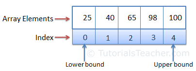

# C# ARRAYS: SINGLE DIMENSIONAL


--- 


## LINKS

[A list of all Array methods from System.Array class](https://learn.microsoft.com/en-us/dotnet/api/system.array?view=netcore-3.1#methods)

[C# Arrays](https://www.tutorialsteacher.com/csharp/array-csharp)


---


## DESCRIPTION

A variable is used to store a literal value, whereas an array is used to store multiple literal values.

An array is the data structure that stores a fixed number of literal values (elements) of the same data type. Array elements are stored contiguously in the memory.

In C#, an array can be of three types:
 - single-dimensional
 - multidimensional
 - jagged array.

Here you will learn about the single-dimensional array.

The following figure illustrates an array representation.




---


## DECLARATION & INITIALIZATION

An array can be declared using by specifying the type of its elements with square brackets.

**Array declaration**:
```cs
int[] evenNums;  // integer array

string[] cities; // string array
```


The following declares and adds values into an array in a single statement.
**Array declaration and initialization**:
```cs
int[] evenNums = new int[5]{ 2, 4, 6, 8, 10 }; 

string[] cities = new string[3]{ "Mumbai", "London", "New York" };
```
Above, evenNums array can store up to five integers. The number 5 in the square brackets new int[5] specifies the size of an array. In the same way, the size of cities array is three. Array elements are added in a comma-separated list inside curly braces { }.


EvenNums array can store up to five integers. The number 5 in the square brackets new int[5] specifies the size of an array. In the same way, the size of cities array is three. Array elements are added in a comma-separated list inside curly braces { }.

**Short Syntax of Array Declaration**: 
```cs
int[] evenNums = { 2, 4, 6, 8, 10}; 

string[] cities = { "Mumbai", "London", "New York" }
```


**Array declaration using var**:
```cs
var evenNums = new int[]{ 2, 4, 6, 8, 10}; 

var cities = new string[]{ "Mumbai", "London", "New York" };
```


**Invalid Array Creation**:
```cs
//must specify the size 
int[] evenNums = new int[]; 

//number of elements must be equal to the specified size 
int[] evenNums = new int[5] { 2, 4 };

//cannot use var with array initializer
var evenNums = { 2, 4, 6, 8, 10}; 
```


## LATE INITIALIZATION

It is not necessary to declare and initialize an array in a single statement. You can first declare an array then initialize it later on using the new operator.

```cs
int[] evenNums;

evenNums = new int[5];
// or
evenNums = new int[]{ 2, 4, 6, 8, 10 };
```


---


## ACCESSING ARRAY ELEMENTS

Array elements can be accessed using an index. An index is a number associated with each array element, starting with index 0 and ending with array size - 1.

The following example add/update and retrieve array elements using indexes. 

```cs
int[] evenNums = new int[5];
evenNums[0] = 2;    // Index [0] is iqual to 2
evenNums[1] = 4;
//evenNums[6] = 12;  //Throws run-time exception IndexOutOfRangeException

Console.WriteLine(evenNums[0]);  //prints index [0]
Console.WriteLine(evenNums[1]); 
```
```
> 2
> 4
```

```cs
string[] cities = { "Mumbai", "London", "New York" };
string city = "haha";
city = cities[1];
Console.WriteLine(city);
Console.WriteLine(cities[1]);
---


## ACCESSING ARRAY ELEMENTS USING `FOR` LOOP

Use the `for` loop to access array elements. Use the `length` property of an array in conditional expression of the for loop. 

```cs
using System;
					
public class Program
{
	public static void Main()
	{
		int[] evenNums = { 2, 4, 6, 8, 10 };
		
		for (int i = 0; i < evenNums.Length; i++)   // i++ add 1 to index of evenNums
			Console.WriteLine(evenNums[i]); // read values of array elements
		
        Console.WriteLine("After going through each index");
		
		for(int i = 0; i < evenNums.Length; i++)
    		evenNums[i] = evenNums[i] + 10; //increase the value of each element by 10
            Console.WriteLine(evenNums);
		
		Console.WriteLine("After setting values");
		
        // print each number from the array
        // can not print the whole array, only by index
		for (int i = 0; i < evenNums.Length; i++)
			Console.WriteLine(evenNums[i]);
		
	}
	
}
```


---


## ACCESSING ARRAY USING `FOREACH` LOOP

Use `foreach` loop to read values of an array elements without using index. 

```cs
string[] cities = { "Mumbai", "London", "New York" }; 

foreach(var item in evenNums)
    Console.WriteLine(item);   
```
```
> Mumbai
> London
> New York
```


---


## LINQ METHODS

All the arrays in C# are derived from an abstract base class `System.Array`.

The Array class implements the `IEnumerable` interface, so you can LINQ extension methods such as `Max()`, `Min()`, `Sum()`, `reverse()`, etc.

[A list of all Array methods from System.Array class](https://learn.microsoft.com/en-us/dotnet/api/system.array?view=netcore-3.1#methods)

```cs
int[] nums = new int[5]{ 10, 15, 16, 8, 6 };

Console.WriteLine(nums.Max()); // returns 16
Console.WriteLine(nums.Min()); // returns 6
Console.WriteLine(nums.Sum()); // returns 55
Console.WriteLine(nums.Average()); // returns 55
```


The System.Array class also includes methods for creating, manipulating, searching, and sorting arrays. 

**Array methods**:
```cs
int[] nums = new int[5]{ 10, 15, 16, 8, 6 };

Array.Sort(nums); // sorts array 
Array.Reverse(nums); // sorts array in descending order

Array.ForEach(nums, n => Console.WriteLine(n)); // iterates array
Array.BinarySearch(nums, 5);// binary search
```
```
> 16
> 15
> 10
> 8
> 6
```


---


## PASSING ARRAY AS ARGUMENT

An array can be passed as an argument to a method parameter. Arrays are reference types, so the method can change the value of the array elements.

```cs
using System;

public class Program
{
	public static void Main()
	{
		int[] nums = {1, 2, 3, 4, 5};
		UpdateArray(nums);  // Run a function
		foreach (var item in nums)
			Console.WriteLine(item);
	}

	public static void UpdateArray(int[] arr)
	{
		for (int i = 0; i < arr.Length; i++)    // i++ => iterate through each index
			arr[i] = arr[i] + 10;   // adds 10 to each index value
	}
}
```


---


## ARRAY PROPERTy FUNCTIONS

**Array length**
```cs
internal class Program
{
    private static void Main(string[] args)
    {
        string[] cities = { "Mumbai", "London", "New York" };	// our array
        Console.WriteLine(cities.Length);	// "Length" is a property of the array
    }
}
```
```
> 3
```