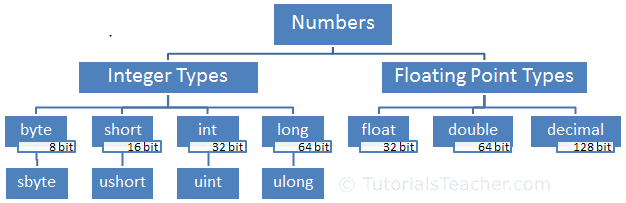

# INTERGER TYPES


---


## DESCRIPTION

`Integer type` numbers are whole numbers without decimal points. It can be negative or positive numbers.
`Integer type` numbers are positive or negative whole numbers without decimal points.
C# includes four data types for integer numbers: byte, short, int, and long. 



| #  | type/keyword |                          Range                          |                Size               |    .NET type   |
|----|:------------:|:-------------------------------------------------------:|:---------------------------------:|:--------------:|
| 1  | byte         | 0 to 255                                                | Unsigned 8-bit integer            | System.Byte    |
| 2  | sbyte        | -128 to 127                                             | Signed 8-bit integer              | System.SByte   |
| 3  | short        | -32,768 to 32,767                                       | Signed 16-bit integer             | System.Int16   |
| 4  | ushort       | 0 to 65,535                                             | Unsigned 16-bit integer           | System.UInt16  |
| 5  | int          | -2,147,483,648 to 2,147,483,647                         | Signed 32-bit integer             | System.Int32   |
| 6  | uint         | 0 to 4,294,967,295                                      | Unsigned 32-bit integer           | System.UInt32  |
| 7  | long         | -9,223,372,036,854,775,808 to 9,223,372,036,854,775,807 | Signed 64-bit integer             | System.Int64   |
| 8  | ulong        | 0 to 18,446,744,073,709,551,615                         | Unsigned 64-bit integer           | System.UInt64  |
| 9  | nint         | Depends on platform (computed at runtime)               | Signed 32-bit or 64-bit integer   | System.IntPtr  |
| 10 | nuint        | Depends on platform (computed at runtime)               | Unsigned 32-bit or 64-bit integer | System.UIntPtr |


---


## 1. BYTE TYPE NUMBERS

The `byte` data type stores numbers from `0 to 255`. It occupies `8-bit in the memory`.
The byte keyword is an alias of the Byte struct in .NET.

The `sbyte` is the same as byte, but it can store negative numbers from `-128 to 127`.
The sbyte keyword is an alias for SByte struct in .NET.

```cs
// Initialize
byte b1 = 255;
byte b2 = -128; // compile-time error: Constant value '-128' cannot be converted to a 'byte'
sbyte sb1 = -128;
sbyte sb2 = 127;

// Check range
Console.WriteLine(Byte.MaxValue);   //255
Console.WriteLine(Byte.MinValue);   //0
Console.WriteLine(SByte.MaxValue);  //127
Console.WriteLine(SByte.MinValue);  //-128
```


---


## 3. SHORT TYPE

The `short` data type is a `signed integer` that can store numbers from `-32,768 to 32,767`. It occupies `16-bit memory`.
The short keyword is an alias for Int16 struct in .NET.

The `ushort` data type is an `unsigned integer`. It can store only positive numbers from `0 to 65,535`.
The ushort keyword is an alias for UInt16 struct in .NET. 

```cs
short s1 = -32768;
short s2 = 32767;
short s3 = 35000;   //Compile-time error: Constant value '35000' cannot be converted to a 'short'

ushort us1 = 65535;
ushort us2 = -32000;    //Compile-time error: Constant value '-32000' cannot be converted to a 'ushort'

Console.WriteLine(Int16.MaxValue);  //32767
Console.WriteLine(Int16.MinValue);  //-32768
Console.WriteLine(UInt16.MaxValue); //65535
Console.WriteLine(UInt16.MinValue); //0
```


---


## 3. INT TYPE

The `int` data type is `32-bit signed integer`. It can store numbers from `-2,147,483,648 to 2,147,483,647`.
The int keyword is an alias of Int32 struct in .NET.

The `uint` is `32-bit unsigned integer`. The uint keyword is an alias of UInt32 struct in .NET.
It can store positive numbers from `0 to 4,294,967,295`. Optionally use U or u suffix after a number to assign it to uint variable.

```cs
// INITIALIZE
int i = -2147483648;
int j = 2147483647;
int k = 4294967295; //Compile-time error: Cannot implicitly convert type 'uint' to 'int'.

uint ui1 = 4294967295;
uint ui2 =-1;   //Compile-time error: Constant value '-1' cannot be converted to a 'uint'

// CHECK RANGE
Console.WriteLine(Int32.MaxValue);  //2147483647
Console.WriteLine(Int32.MinValue);  //-2147483648
Console.WriteLine(UInt32.MaxValue); //4294967295
Console.WriteLine(UInt32.MinValue); //0
```

The int data type is also used for hexadecimal and binary numbers. A hexadecimal number starts with 0x or 0X prefix. C# 7.2 onwards, a binary number starts with 0b or 0B.

```cs
// HEXADECIMAL, BINARY
int hex = 0x2F;
int binary = 0b_0010_1111;

Console.WriteLine(hex);
Console.WriteLine(binary);
```
---


## 7. LONG

The `long` type is `64-bit signed integers`. It can store numbers from `-9,223,372,036,854,775,808 to 9,223,372,036,854,775,807`.
Use l or L suffix with number to assign it to long type variable. The long keyword is an alias of Int64 struct in .NET.

The `ulong` type stores positive numbers from `0 to 18,446,744,073,709,551,615`.
If a number is suffixed by UL, Ul, uL, ul, LU, Lu, lU, or lu, its type is ulong.
The ulong keyword is an alias of UInt64 struct in .NET.

```cs
long l1 = -9223372036854775808;
long l2 = 9223372036854775807;

ulong ul1 = 18223372036854775808ul;
ulong ul2 = 18223372036854775808UL;

Console.WriteLine(Int64.MaxValue);//9223372036854775807
Console.WriteLine(Int64.MinValue);//-9223372036854775808
Console.WriteLine(UInt64.MaxValue);//18446744073709551615
Console.WriteLine(UInt64.MinValue);//0
```


---


