## CODE REFACTORING TECHNIQUES


---


## LINKS

[Refactoring Techniques](https://refactoring.guru/refactoring/techniques)


---


## 5. Simplifying Method Calls

These techniques make method calls simpler and easier to understand. This, in turn, simplifies the interfaces for interaction between classes.

- 5.1  Add Parameter
- 5.2  Remove Parameter
- 5.3  Rename Method
- 5.4  Separate Query from Modifier
- 5.5  Parameterize Method
- 5.6  Introduce Parameter Object
- 5.7  Preserve Whole Object
- 5.8  Remove Setting Method
- 5.9  Replace Parameter with Explicit Methods
- 5.10 Replace Parameter with Method Call
- 5.11 Hide Method
- 5.12 Replace Constructor with Factory Method
- 5.13 Replace Error Code with Exception
- 5.14 Replace Exception with Test


---


## 5.1 Add Parameter

**Problem**

A method doesn’t have enough data to perform certain actions.

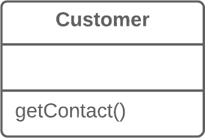


**Solution**

Create a new parameter to pass the necessary data.

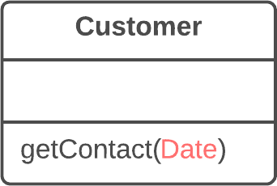


---


## 5.2 Remove Parameter

**Problem**

A parameter isn’t used in the body of a method.


**Solution**

Remove the unused parameter.


---


##  5.3 Rename Method

**Problem**

The name of a method doesn’t explain what the method does.

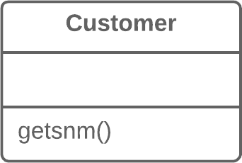


**Solution**

Rename the method.

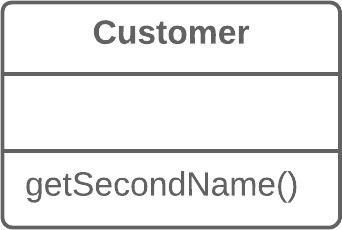


---


## 5.4 Separate Query from Modifier

**Problem**

Do you have a method that returns a value but also changes something inside an object?


**Solution**

Split the method into two separate methods. As you would expect, one of them should return the value and the other one modifies the object.

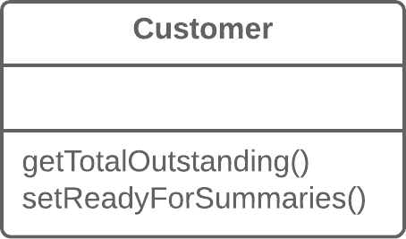


---


## 5.5 Parameterize Method

**Problem**

Multiple methods perform similar actions that are different only in their internal values, numbers or operations.

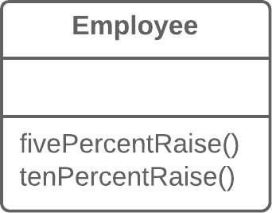


**Solution**

Combine these methods by using a parameter that will pass the necessary special value.

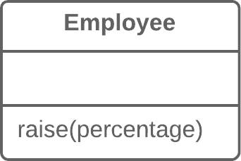


---


## 5.6 Introduce Parameter Object

**Problem**

Your methods contain a repeating group of parameters.

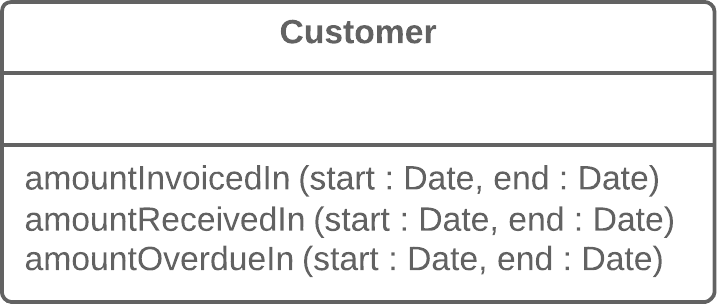


**Solution**

Replace these parameters with an object.

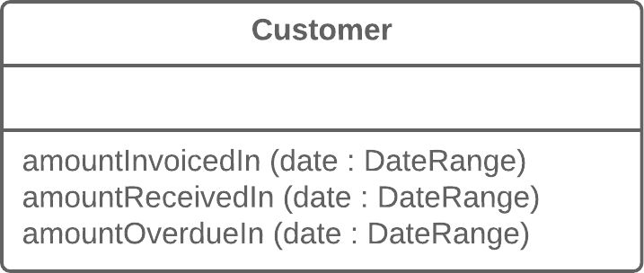


---


## 5.7 Preserve Whole Object

**Problem**

You get several values from an object and then pass them as parameters to a method.

```cs
int low = daysTempRange.GetLow();
int high = daysTempRange.GetHigh();
bool withinPlan = plan.WithinRange(low, high);
```


**Solution**

Instead, try passing the whole object.

```cs
bool withinPlan = plan.WithinRange(daysTempRange);
```


---


## 5.8 Remove Setting Method

**Problem**

The value of a field should be set only when it’s created, and not change at any time after that.

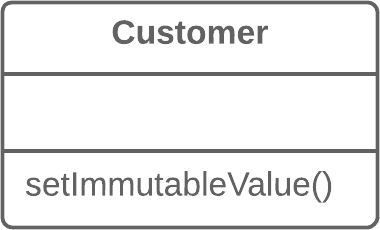


**Solution**

So remove methods that set the field’s value.

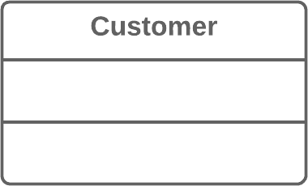


---


## 5.9 Replace Parameter with Explicit Methods

**Problem**

A method is split into parts, each of which is run depending on the value of a parameter.

```cs
void SetValue(string name, int value) 
{
  if (name.Equals("height")) 
  {
    height = value;
    return;
  }
  if (name.Equals("width")) 
  {
    width = value;
    return;
  }
  Assert.Fail();
}
```


**Solution**

Extract the individual parts of the method into their own methods and call them instead of the original method.

```cs
void SetHeight(int arg) 
{
  height = arg;
}
void SetWidth(int arg) 
{
  width = arg;
}
```


---


## 5.10 Replace Parameter with Method Call

**Problem**

Calling a query method and passing its results as the parameters of another method, while that method could call the query directly.

```cs
int basePrice = quantity * itemPrice;
double seasonDiscount = this.GetSeasonalDiscount();
double fees = this.GetFees();
double finalPrice = DiscountedPrice(basePrice, seasonDiscount, fees);
```


**Solution**

Instead of passing the value through a parameter, try placing a query call inside the method body.

```cs
int basePrice = quantity * itemPrice;
double finalPrice = DiscountedPrice(basePrice);
```


---


## 5.11 Hide Method

**Problem**

A method isn’t used by other classes or is used only inside its own class hierarchy.

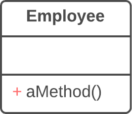


**Solution**

Make the method private or protected.

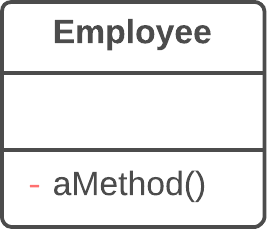


---


## 5.12 Replace Constructor with Factory Method

**Problem**

You have a complex constructor that does something more than just setting parameter values in object fields.

```cs
public class Employee 
{
  public Employee(int type) 
  {
    this.type = type;
  }
  // ...
}
```


**Solution**

Create a factory method and use it to replace constructor calls.
JavaC#PHPPythonTypeScript

```cs
public class Employee
{
  public static Employee Create(int type)
  {
    employee = new Employee(type);
    // Do some heavy lifting.
    return employee;
  }
  // ...
}
```


---


## 5.13 Replace Error Code with Exception

**Problem**

A method returns a special value that indicates an error?

```cs
int Withdraw(int amount) 
{
  if (amount > _balance) 
  {
    return -1;
  }
  else 
  {
    balance -= amount;
    return 0;
  }
}
```


**Solution**

Throw an exception instead.

```cs
///<exception cref="BalanceException">Thrown when amount > _balance</exception>
void Withdraw(int amount)
{
  if (amount > _balance) 
  {
    throw new BalanceException();
  }
  balance -= amount;
}
```


---


## 5.14 Replace Exception with Test

**Problem**

You throw an exception in a place where a simple test would do the job?

```cs
double GetValueForPeriod(int periodNumber) 
{
  try 
  {
    return values[periodNumber];
  } 
  catch (IndexOutOfRangeException e) 
  {
    return 0;
  }
}
```


**Solution**

Replace the exception with a condition test.

```cs
double GetValueForPeriod(int periodNumber) 
{
  if (periodNumber >= values.Length) 
  {
    return 0;
  }
  return values[periodNumber];
}
```


