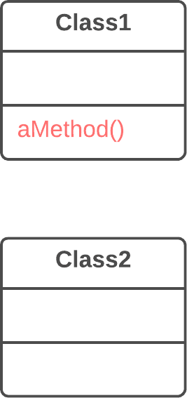
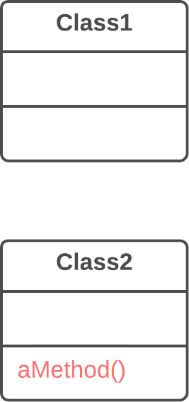
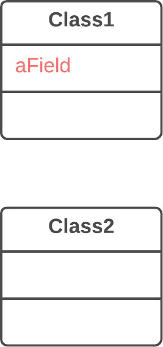
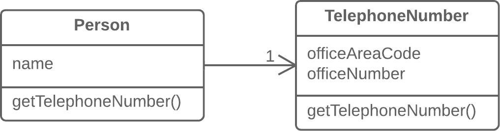
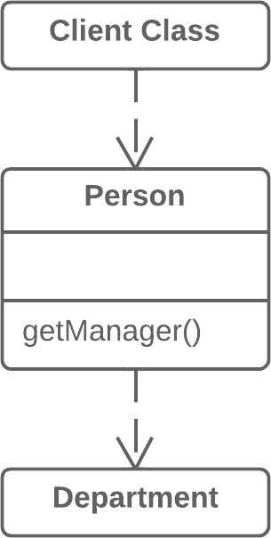
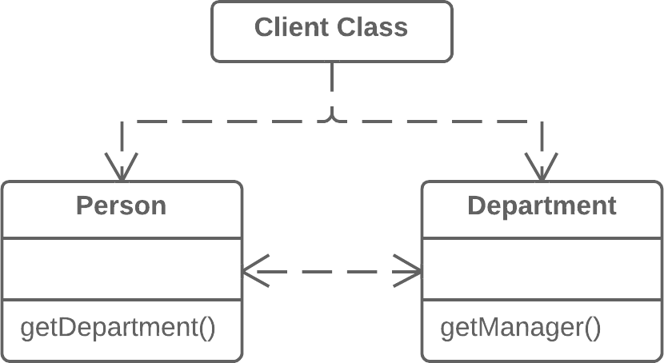
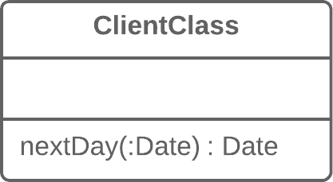
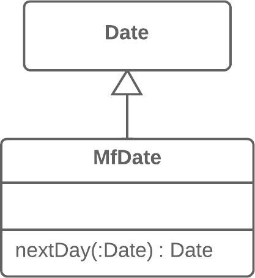

## CODE REFACTORING TECHNIQUE: MOVING FEATURES BETWEEN OBJECTS


---


## LINKS

[Refactoring Techniques](https://refactoring.guru/refactoring/techniques)


---


## 2. MOVING FEATURES BETWEEN OBJECTS

Even if you have distributed functionality among different classes in a less-than-perfect way, there is still hope.

These refactoring techniques show how to safely move functionality between classes, create new classes, and hide implementation details from public access.

- 2.1 Move Method
- 2.2 Move Field
- 2.3 Extract Class
- 2.4 Inline Class
- 2.5 Hide Delegate
- 2.6 Remove Middle Man
- 2.7 Introduce Foreign Method
- 2.8 Introduce Local Extension


---


## 2.1 Move Method

**Problem**

A method is used more in another class than in its own class.




**Solution**

Create a new method in the class that uses the method the most, then move code from the old method to there. Turn the code of the original method into a reference to the new method in the other class or else remove it entirely.




---


## 2.2 Move Field

**Problem**

A field is used more in another class than in its own class.



**Solution**

Create a field in a new class and redirect all users of the old field to it.


---


## 2.3 Extract Class

**Problem**

When one class does the work of two, awkwardness results.


**Solution**

Instead, create a new class and place the fields and methods responsible for the relevant functionality in it.


---


## 2.4 Inline Class

**Problem**

A class does almost nothing and isn’t responsible for anything, and no additional responsibilities are planned for it.




**Solution**

Move all features from the class to another one.


---


## 2.5 Hide Delegate

**Problem**

The client gets object B from a field or method of object А. Then the client calls a method of object B.


**Solution**

Create a new method in class A that delegates the call to object B. Now the client doesn’t know about, or depend on, class B.




---


## 2.6 Remove Middle Man

**Problem**

A class has too many methods that simply delegate to other objects.


**Solution**

Delete these methods and force the client to call the end methods directly.




---


## 2.7 Introduce Foreign Method

**Problem**

A utility class doesn’t contain the method that you need and you can’t add the method to the class.

```cs
class Report 
{
  // ...
  void SendReport() 
  {
    DateTime nextDay = previousEnd.AddDays(1);
    // ...
  }
}
```


**Solution**

Add the method to a client class and pass an object of the utility class to it as an argument.

```cs
class Report 
{
  // ...
  void SendReport() 
  {
    DateTime nextDay = NextDay(previousEnd);
    // ...
  }
  private static DateTime NextDay(DateTime date) 
  {
    return date.AddDays(1);
  }
}
```


---


## 2.8 Introduce Local Extension

**Problem**

A utility class doesn’t contain some methods that you need. But you can’t add these methods to the class.




**Solution**

Create a new class containing the methods and make it either the child or wrapper of the utility class.




---