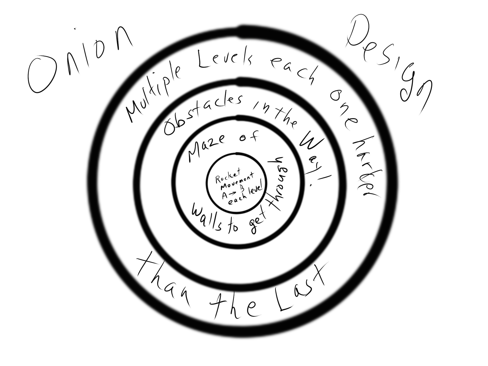
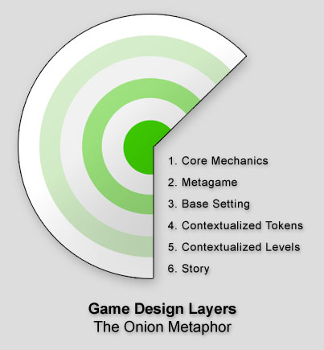

# ONION DESIGN

---

## LINKS

---

## DESCRIPTION

Making a great game with limited resources is all about focus. There are a wide variety of areas that you can put resources into ranging from core gameplay to level design to story. The problem facing most new game developers is that they attempt to have the best of all worlds. That, my friends, is a recipe for failure.

This little post describes the concept of game design layers and gives you some very simple analytical tools for understanding where you are investing and what the consequences can be. In the end we’ll:

    Arrive at a practical definition of innovation.
    Describe major strategies of product differentiation.
    Show how pursuing innovation can affect your team structure.

(And if you ever hear an indie game developer talking about level design, either shoot them in the head now to help them avoid their future misery, or direct them towards this essay.)

## The layers of a game
A game is built like an onion. Each layer of the game polishes an aspect of the previous structure and makes it slightly more appealing. Areas near the inner core give you the most bang for your buck. Areas near the outer edges of the game design are easier to change without unbalancing the system, but don’t make as big of an impact.

        Core game mechanics
        Meta game mechanics
        Base setting
        Contextualized Tokens (Graphics, Sound, etc.)
        Contextualized Scenarios (Levels and Scripted events)
        Overall story

## 1. Core game mechanics:
The basic risk and reward schedules that the player partakes in form the fundamental basis of the gameplay. In general, the gamer will spend 80% or more of their time performing simple, repetitive core game mechanics. In Doom, this might include running around and shooting enemies. In a RTS, it might involve building up units and attacking other units. Core mechanics borrow from the world of board game design and can typically be abstractly defined in the following terms:

    Object-oriented tokens.
    Properties on tokens.
    The interactions between tokens and the player as defined in an explicit set of rules.

## 2. Meta game mechanics
Meta game mechanics are a set of game mechanics that tie together core game mechanics. The most classic example is an RPG. The first RPGs had a simple exploration mode that gave a way of linking multiple tactical battles together. Meta game mechanics also include simple initial starting conditions and end of game rules.

## 3. Base Setting
The base setting is simple background information that gives context to the actions performed within the game. From a marketing perspective, setting acts as an initial hook that gets the player involved and interested in the game in the period of time before the addictive quality of the core game mechanics sets in. An example setting would be labeling a game as a ‘fantasy game’ or ‘golf game’.

## 4. Contextualized Tokens (Graphics, Sound, etc.)
Graphics and sound extend the base setting and provide additional visual context for the abstract game mechanics. By providing a richer, more intuitive set of symbolic stimuli to the player, the game designer can shorten the learning curve of the core mechanics. A blocky red ‘alien’ from Space Invaders is difficult to recognize as ‘hostile’. An enemy from the latest Doom game is much more immediately understandable as a token that must be avoided.

## 5. Contextualized Scenarios (Levels, Scripted Events etc)
Core game mechanics often focus on the interactions between various pre-defined game tokens. Levels and pre-scripted events exist to put the player in an emotionally interesting arrangement of tokens that support both the base setting and the contextualized tokens.

## 6. Overall Story
The range of emotions that core gameplay can evoke is relatively limited. The context provided by levels and scripted events allows an additional level of emotional involvement. Story brings a narrative element to that game that provides an additional wrapper of context for the actions that the player performs. This lets the designer evoke additional responses beyond what the core mechanics allow.

## The hierarchy of layers
Each of these six layers build upon one another. You must have the lower layers in order to attempt the higher layers.

The metagame, for example, is impossible to create without first defining core game mechanics. The story is impossible to tell without having the ability to construct pre-defined scenarios.

Most commercial games have all six layers, but historically this has not typically been the standard. Let’s briefly look at the game of chess:

    Core gameplay: Very well defined
    Metagame mechanics: Limited to governing the beginning and end of the game
    Base setting: Limited to an abstract conflict between to medieval forces.
    Contextualized tokens: Limited to rough descriptions of pawns, knights, queens, etc. In reality, the names exist primarily to support the base setting and give little, if any intuitive understanding of how the pieces operate.
    Contextualized Scenarios: None. You could make a very tenuous argument that the two lines of tokens evoke armies facing one another, but why bother?
    Story: None.

So you can build a very successful game without investing anything in the last two layers and paying mere lip service to the concept of contextualized tokens. In a game like Tetris, the designer really only worried about core gameplay and metagame mechanics.

A new game designer should be aware of the various layers and most importantly know that you can still make a great game without investing substancial effort in all six areas. This lesson alone can save many projects from feature creep and burnout.

## The cost of investing in each layer

Each game design makes an explicit decision to invest in the various layers of the final game. When you invest human resources, you are ultimately investing money. With money comes financial risk and payoff. If the game is a success, you’ll receive more money back based on your investment. If the game is a failure, you made a poor investment in the various layers of the game.

Not all game design investments are equal. In general, investments in lower layers early in the game’s development have the greatest impact on the addictive qualities of your game. Investment in the higher layers have smaller impact.

However, this is not the complete story. With each change, there is always a risk of unbalancing the game’s psychological risk and reward schedules. Unbalancing ruins the addictive qualities of your game and increases the chance of the game’s failure. Changes to lower layers have a greater risk of unbalancing a game design, while changes to higher layers have a lesser risk of unbalancing the game design.

All of this pose some fascinating resource allocation decisions for game designers and publishers. Two extreme strategies immediately become apparent. On one hand the designer may focus on early layers and get a lot of bang for their buck. However, they dramatically increase the chances of the game being a failure since any change along the way can hurt the addictive qualities of the game. On the other hand, the designer can start with a proven addictive core game mechanic and focus their efforts on later layers. This is much more expensive, but ensures the team has a good chance of producing an addictive game that is ‘better than proceeding generations’.

## A method of classifying games

This is all interesting, but ends up being overly abstract for most people. Let’s make it practical by showing you how you can apply these concepts to your game.

    Take a game design and break it up into the tasks necessary to complete the project.
    Assign each task to one of the 6 layers.
    Put a cost (either in time or dollars, depending on your project) on each task.
    Add up the cost of all the tasks in each category and divide them by the total project cost to get the percentage of resources you are spending in each layer.

You should end up with a distribution graph that looks something like this:

##  The Innovation Scale

You can also calculate a general ‘innovation’ scale to classify your game title by taking the weighted average of all six categories. For example, you might have something that looks like this:

Chess innovation score = (60% x 1) + (20% x 2) + (10% x 3) + (10% x 4) + (0% x 5) + (0% x 6) = 1.7 out of 6

Now we have defined a scale from 1 to 6. At one end of the scale are highly innovative titles and at the other end of the scale are highly polished titles.

## Uses of the innovation scale
It should be very clear that the innovation scale relates primarily to the game developer’s investment and not to the market’s perception of innovation. This is intended to be a tool used by game developers who have intimate understanding of their development costs. Without development costs, it is difficult to gain an objective innovation rating across multiple titles. The layer classification scheme gives developers a ‘balanced’ score card management tool that lets them quickly and easily understand where they are investing their valuable resources.

This is also of use to publishers when they are balancing their portfolios. The ‘genre’ method of balancing portfolios is limited and punishes innovative games. The layer-based classification system takes into account risk and cost of production without culling titles because they fail to fit into an established category.

## Innovation and the life cycle of genres
Genres have life cycles. They start out with the majority of titles investing heavily in lower layers of the game design. These high risk titles have lots of innovation, but very little polish. As they mature, titles invest more in the higher layers of the game design. This results in less innovation, but lower risk. These are self evident results, but it is always good to throw something obvious at a new framework.

## Innovation and Indie game developers
To put it simply, independent game developers generally cannot afford to invest in the higher layers of game development. With limited resources, you can’t be innovative and polished at the same time.

In my opinion, the ideal indie team is a small agile group composed primarily of programmers with only 20 to 30% artists. Such a team can compete with the best teams that EA has to offer in terms of core game mechanics. They have the luxury of being able to inexpensively and rapidly change the game design, iterating through dozens of rulesets in order to find one that offers a uniquely addictive experience.

As soon as you bring complex level design and story to the design, you lose flexibility. You lose the ability to innovate. Companies that focus on polished games have artist heavy teams and rigidly defined production cycles. This results in a huge investment in human capital and a corresponding high cost of failure. Remember, each layer builds on the preceding layers. The moment you start making changes to the core game mechanics, you send a ripple of changes all the way through the rest of the game. Content needs to be tossed or reworked.

In a innovation-oriented team, an interesting change to core game mechanics might result in a few weeks lost. In a polish oriented team, changes to core mechanics late in the development of a game can result in dozens of man years lost. Polish-oriented teams are inherently anti-innovation.

Larger teams try to balance both low layer activities and high layer activities by splitting the development into a ‘prototyping’ stage and a ‘production’ stage. The result is incremental innovation cut off short by the looming end of the prototyping stage and constrained the intense logistical demands of the production team.

## The innovation-focused game team
What would happen if instead you doubled the resources spent on the traditional ‘prototyping’ period, worked in tight interative cycles and then shipped it the product directly to testers? Instead of levels, you use procedural content. Instead of plot, you focus on interesting reusable game objects that introduce delightful meta-game mechanics into the title. After every iteration, you have a playable game.

    The development team follows agile development processes with rapid iterations and considerable playtesting
    The majority of development effort is put into core mechanics and meta-game mechanics.
    Graphics and sounds are abstract tokens only loosely connected to a base setting.
    No level design is allowed since it is a waste of time.
    No plot is allowed since it is a distraction.
    Statistical metrics of player addiction are used to judge success. (How long did they play, how often did they play, were they willing to play again)

This is game design refactored. The result is an agile object-oriented system that responds swiftly to change, and does not inherently resist it like current team structures. Innovation-focused teams build radically different types of game that are guaranteed to be less expensive and shockingly more original that those produced by the current game development model.

## CONCLUSION

The basic concept of ‘innovation’ has been discussed in vague terms for far too long. The concept of game design layers provides a framework for classifying the game developer’s investment in innovation and polish oriented activities.

With hard numbers in-hand, developers can make more informed strategic business decisions regarding the balance of innovation, risk, and team structure. I believe that there is a huge opportunity in the game industry to create smaller, agile ‘innovation-focused’ teams. Smart game designs that are based on a deep understanding of balancing resource investment in the various game design layers have a greater probability of producing original, genre-busting game designs.

---

## OTHER DESIGNS

