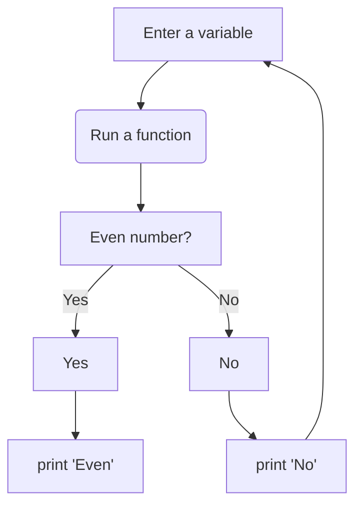
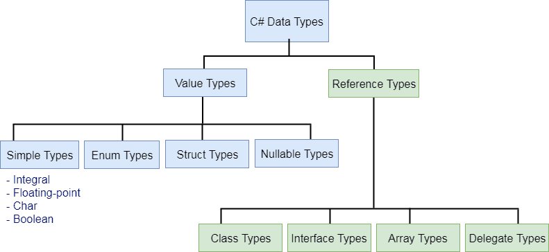

# DEFAULT MARKDOWN


---


### USED LINKS

[Basic writing and formatting syntax (GitHub - Markdown README files)](https://docs.github.com/en/get-started/writing-on-github/getting-started-with-writing-and-formatting-on-github/basic-writing-and-formatting-syntax)

[Markdown Python course files](https://github.com/programiz/python-course)


---


# HEADINGS & PARAGRAPHS

## Heading 2
### Heading 3
#### Heading 4
##### Heading 5
###### Heading 6

This is a paragraph with `highlighted word 1`, `word2`, `word3`


---


# BOLD, ITALIC, STRIKE-THROUGH, QUOTE

<!-- Italics -->
*This text* is italic

_This text_ is italic

<!-- Strong -->
**This text** is italic

__This text__ is italic

<!-- Strikethrough -->
~~This text~~ is strikethrough

<!-- Blockquote -->
> This is a quote


---


### ORIZONTAL RULE

<!-- Horizontal rule 1 -->
---

<!-- Horizontal rule 2 -->
___


---


### LINKS

<!-- Links -->
[`Highlighted link`](http://www.traversymedia.com)

[Traversy Media](http://www.traversymedia.com)

[Traversy Media](http://www.traversymedia.com "Traversy Media")

[LICENSE file with relative path](LICENSE.rst)


---


### UL LIST

* Item 1
* Item 2
* Item 3
  * Nested Item 1
  * Nested Item 2


1. Item 1
1. Item 2
1. Item 3
2.


---


### INLINE CODE BLOCK

`<p>This is a paragraph</p>`


---


### DIAGRAMS

[Mermaid diagrams](https://mermaid-js.github.io/mermaid/#/)

[Mermaid Live Editor](https://mermaid-js.github.io/mermaid-live-editor/edit#pako:eNpVkMtqw0AMRX9FaJVC_ANeFBo7ySbQQrPzeCE8cmZo5sFYpgTb_95x00KileCcexGasAuascRLomjgXCsPed6ayiQ7iKOhhaJ4nY8s4ILn2wy7zTHAYEKM1l9e7v5ulaCaTqvGIMb6r-WOqt_8u-cZ6uZEUUJsH8n5O8ywb-yHyfXPxCTOqUPTU9lT0VGCilKLW3ScHFmdz57WgEIx7FhhmVfNPY1XUaj8ktUxahLeayshYa65DrxFGiV83nyHpaSR_6XaUv6C-7OWH4tPW9M)




[Plain UML](https://plantuml.com/)

[PyCharm IDE Diagrams](https://www.jetbrains.com/help/pycharm/markdown.html#diagrams)


---


### IMAGES

Absolute path:

<br/></br>

Relative path:



---


# Github Markdown:

This section is empty.


---


### CODE BLOCKS

<!-- Bash Code Block -->
```bash
  npm install

  npm start
```


<!-- Javascript Code Block -->
```javascript
  function add(num1, num2) {
    return num1 + num2;
  }
```


<!-- Python Code Block -->
```python
  def add(num1, num2):
    return num1 + num2
```


---


### TABLES

[On-line table generator](https://www.tablesgenerator.com/markdown_tables#)

|   Name   | Email          |
|:--------:|----------------|
| John Doe | john@gmail.com |
| Jane Doe | jane@gmail.com |

`|:--------:|` centers the contents in the column


---


### TASK LIST

* [x] Task 1
* [x] Task 2
* [ ] Task 3


---


### IGNORE MARKDOWN FORMATTING

You can tell GitHub to ignore (or escape) Markdown formatting by using **\** before the Markdown character.

```
Let's rename \*our-new-project\* to \*our-old-project\*.
```


---


### FOOTNOTES

Only displays in Github.
Here is a simple footnote[^1].

A footnote can also have multiple lines[^2].  

You can also use words, to fit your writing style more closely[^note].

[^1]: My reference.
[^2]: Every new line should be prefixed with 2 spaces.  

This allows you to have a footnote with multiple lines.


---


# HTML SPECIFIC:


---


### Create empty line & comment:
```
<br/><br/>  <!-- Create empty line & comment it -->
```


---


### HTML Supported links:
<p align="center">
    <a href="https://github.com/mathLab/EZyRB/blob/master/LICENSE.rst" target="_blank">
        
    </a>
    <a href="https://travis-ci.org/mathLab/pydata" target="_blank">
        
    </a>
    <a href="https://coveralls.io/github/mathLab/pydata" target="_blank">
        
    </a>
</p>


---


### SVG links:
[](https://pypi.python.org/pypi/unix_ar/)
[](https://travis-ci.org/getninjas/unix_ar)
[](https://unix_ar.readthedocs.io/en/latest/?badge=latest)


---


# EQUATIONS:


---

### HTML Subscript (Substitution)(HTML Entities)(HTML <sub> Tag)

**[HTML ampersand entity codes](https://www.w3schools.com/html/html_entities.asp)**

**[Common math symbols](http://sites.psu.edu/symbolcodes/codehtml/#math)**

**[Codes for Greek letters](https://www.keynotesupport.com/websites/greek-letters-symbols.shtml)**

**[UTF-8 Mathematical Operators](https://www.w3schools.com/charsets/ref_utf_math.asp)**

###### Unknown example:
h<sub>&theta;</sub>(x) = &theta;<sub>o</sub> x + &theta;<sub>1</sub>x

###### Quadratic example:
ax<sup>2</sup>+bx+c=0

###### Binary example
1011012 = (1 × 2<sup>5</sup>) + (0 × 2<sup>4</sup>) + (1 × 2<sup>3</sup>) + (1 × 2<sup>2</sup>) + (0 × 2<sup>1</sup>) + (1 × 2<sup>0</sup>) = 45<sub>10</sub>


---


### Latex


---


### Jupyter


---


### MathML
Link: [Display Math Notation with HTML Substitution](https://www.webassign.net/manual/instructor_guide/c_i_displaying_math_notation_with_html_substitution.htm)

###### Quadratic:
<math>
  <mrow>
    <msup>
      <mi>x</mi>
      <mn>2</mn>
    </msup>
    <mo>+</mo>
    <mn>6</mn>
    <mo>⁢</mo>
    <mi>x</mi>
    <mo>+</mo>
    <mn>5</mn>
  </mrow>
</math>
<br></br>

###### Fraction:
<math>
    <mrow>
        <mfrac>
            <mrow>
                <msup>
                    <mi>x</mi>
                    <mn>2</mn>
                </msup>
            </mrow>
            <mrow>
                <mi>x</mi>
                <mo>+</mo>
                <mn color="red">9</mn>
            </mrow>
        </mfrac>
    </mrow>
</math>
<br></br>

###### Function:
When
<math>
  <mi>a</mi><mo>&#x2260;</mo><mn>0</mn>
</math>,
there are two solutions to
<math>
  <mi>a</mi><msup><mi>x</mi><mn>2</mn></msup>
  <mo>+</mo> <mi>b</mi><mi>x</mi>
  <mo>+</mo> <mi>c</mi> <mo>=</mo> <mn>0</mn>
</math>
and they are
<math display="block">
  <mi>x</mi> <mo>=</mo>
  <mrow>
    <mfrac>
      <mrow>
        <mo>&#x2212;</mo>
        <mi>b</mi>
        <mo>&#x00B1;</mo>
        <msqrt>
          <msup><mi>b</mi><mn>2</mn></msup>
          <mo>&#x2212;</mo>
          <mn>4</mn><mi>a</mi><mi>c</mi>
        </msqrt>
      </mrow>
      <mrow>
        <mn>2</mn><mi>a</mi>
      </mrow>
    </mfrac>
  </mrow>
  <mtext>.</mtext>
</math>
</p>


---


### USING IMAGE GENERATORS
[TeXify](https://github.com/apps/texify)


---


### URL ENCODER
[www.urlencoder.org](https://www.urlencoder.org/)


---


### JAVASCRIPT
