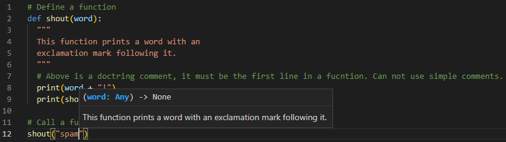

# PYTHON: COMMENTS


---


## IDE SHORTCUTS

Use `Ctrl+/` to comment lines in Atom


---


##  SINGLE LINE COMMENTS

'#' is an octothorpe, a number sign or hash symbol

```python
# print("Hello, World!")
print("Hello, World!") # This is a comment
# print("Hello, World!")
```
```
> Hello, World!
```


--- MULTI-LINE COMMENTS

```python
"""
This is a comment
written in
more than just one line
"""
print("Hello, World!")

# is the same as:
'''
This is a comment
written in
more than just one line
'''
```
```
> Hello, World!
```


## DOCSTRINGS (documentation strings)

Similar to comments, designed to explain code. But, they’re more specific and have a different syntax.
They’re created by putting a multiline string containing an explanation of the function below the function's first line. Like this:
Docstrings act as documentation for other developers who use your function.

**Define a docstring in a function**:
```python
# Define a function
def shout(word):
  """
  This function prints a word with an
  exclamation mark following it.
  """
  # Above is a doctring comment, it must be the first line in a fucntion. Can not use simple comments.
  print(word + "!")
  print(shout.__doc__) # will print the Docstring

# Call a function 'shout'
shout("spam")
```
```
> spam!
> 
>   This function prints a word with an
>   exclamation mark following it.     
```

Our IDE will show us the comment of our function like this:




**Read docstings of modules and their functions**:
```python
import math

print(math.__doc__)     # show `math` module docstring, documentation
print("---")  # empty line
print(math.pi.__doc__)  # show pi function docstring
```
```
> This module provides access to the mathematical functions
> defined by the C standard.
> ---
> Convert a string or number to a floating point number, if possible.
```


---