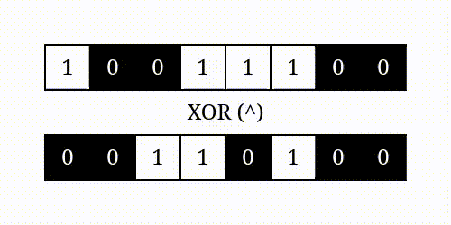
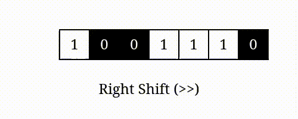

# BITWISE OPERATORS


---


## LINKS

[Bitwise Operators in Python (realpython.com)](https://realpython.com/python-bitwise-operators/)


---


## DESCRIPTION

Computers store all kinds of information as a stream of binary digits called bits. Python’s bitwise operators let you manipulate those individual bits of data at the most granular level.

You can use bitwise operators to implement algorithms such as compression, encryption, and error detection as well as to control physical devices in your Raspberry Pi project or elsewhere. Often, Python isolates you from the underlying bits with high-level abstractions. You’re more likely to find the overloaded flavors of bitwise operators in practice. But when you work with them in their original form, you’ll be surprised by their quirks!

You can think of them as functions that take advantage of a more compact prefix and infix syntax.


---


## TABLE

Bitwise operators look virtually the same across different programming languages:

№| Operator | Example | Name                       | Description  
-|----------|---------|----------------------------|-------------
1| `&`      | a & b   | Bitwise AND                | Sets each bit to 1 if both bits are 1
2| `\|`     | a \| b  | Bitwise OR                 | Sets each bit to 1 if one of two bits is 1
3| `^`      | a ^ b   | Bitwise XOR (exclusive OR) | Sets each bit to 1 if only one of two bits is 1
4| `~`      | ~a      | Tilde. Bitwise NOT         | Unary operand. Inverts all the bits
5| `<<`     | a << n  | Bitwise left shift         | Zero fill left shift. Shift left by pushing zeros in from the right and let the leftmost bits fall off
6| `>>`     | a >> n  | Bitwise right shift        | Signed right shift. Shift right by pushing copies of the leftmost bit in from the left, and let the rightmost bits fall off


---


## 1. `&` Bitwise AND

The bitwise AND operator (&) performs `logical conjunction` on the corresponding bits of its operands. For each pair of bits occupying the same position in the two numbers, it returns a one only when both bits are switched on:


The resulting bit pattern is an `intersection` of the operator’s arguments. It has two bits turned on in the positions where both operands are ones. In all other places, at least one of the inputs has a zero bit.

Arithmetically, this is equivalent to a `product` of two bit values. You can calculate the bitwise AND of numbers a and b by multiplying their bits at every index _i_:


(a & b)<sub>i</sub> = a<sub>i</sub> * b<sub>i</sub>


A one multiplied by one gives one, but anything multiplied by zero will always result in zero. Alternatively, you can take the `minimum` of the two bits in each pair. Notice that when operands have unequal bit-lengths, the shorter one is automatically padded with zeros to the left.


|        	|   	|   	|   	|   	|     |
|---------|---	|---	|---	|---	|---  |
| Input1 	| 0 	| 0 	| 1 	| 1 	| &   |
| Input2 	| 0 	| 1 	| 0 	| 1 	|     |
| Output 	| 0 	| 0 	| 0 	| 1 	|     |


**Example**:
```python
a = 50      # 110010 &
b = 25      # 011001
c = a & b   # 010000
print(c)
print(bin(c))
```
```
> 16
> 0b10000
```


**Example**:
```python
a = 5       #   101 &
b = 25      # 11001
c = a & b   # 00001
print(c)
print(bin(c))
```
```
> 1
> 0b1
```


---


## 2. `\|` BITWISE OPERATOR `OR`

The bitwise OR operator (|) performs `logical disjunction`. For each corresponding pair of bits, it returns a one if at least one of them is switched on:


The resulting bit pattern is a `union` of the operator’s arguments. It has five bits turned on where either of the operands has a one. Only a combination of two zeros gives a zero in the final output.

The arithmetic behind it is a combination of a `sum` and a `product` of the bit values. To calculate the bitwise OR of numbers a and b, you need to apply the following formula to their bits at every index _i_:


(a | b)<sub>i</sub> = a<sub>i</sub> + b<sub>i</sub> - (a<sub>i</sub> * b<sub>i</sub>)


It’s almost like a sum of two bits but clamped at the higher end so that it never exceeds the value of one. You could also take the maximum of the two bits in each pair to get the same result.


|        	|   	|   	|   	|   	|     |
|---------|---	|---	|---	|---	|---  |
| Input1 	| 0 	| 0 	| 1 	| 1 	| OR  |
| Input2 	| 0 	| 1 	| 0 	| 1 	|     |
| Output 	| 0 	| 1 	| 1 	| 1 	|     |


```python
a = 50      # 0b110010 |
b = 25      # 0b011001
c = a | b   # 0b111011
print(c)
print(bin(c))
```
```
> 59
> 0b111011
```


---


## 3. `^` BITWISE OPERATOR `XOR`

Unlike bitwise `AND`, `OR`, and `NOT`, the bitwise `XOR operator (^)` doesn’t have a logical counterpart in Python. However, you can simulate it by building on top of the existing operators:

```python
def xor(a, b):
    return (a and not b) or (not a and b)
```

It evaluates two mutually exclusive conditions and tells you whether exactly one of them is met. For example, a person can be either a minor or an adult, but not both at the same time. Conversely, it’s not possible for a person to be neither a minor nor an adult. The choice is mandatory.

The name XOR stands for `exclusive or` since it performs exclusive disjunction on the bit pairs. In other words, every bit pair must contain opposing bit values to produce a one:



Visually, it’s a `symmetric difference` of the operator’s arguments. There are three bits switched on in the result where both numbers have different bit values. Bits in the remaining positions cancel out because they’re the same.

Similarly to the bitwise OR operator, the arithmetic of XOR involves a sum. However, while the bitwise OR clamps values at one, the XOR operator wraps them around with a `sum modulo two`(`take the remainder after dividing by 2`):


(a ^ b)<sub>i</sub> = (a<sub>i</sub> + b<sub>i</sub>)<sub>mod 2</sub> = (a<sub>i</sub> + b<sub>i</sub>) % 2


Modulo is a function of two numbers—the dividend and the divisor—that performs a division and returns its remainder. In Python, there’s a built-in modulo operator denoted with the percent sign (%).

|        	|   	|   	|   	|   	|     |
|---------|---	|---	|---	|---	|---  |
| Input1 	| 0 	| 0 	| 1 	| 1 	| XOR |
| Input2 	| 0 	| 1 	| 0 	| 1 	|     |
| Output 	| 0 	| 1 	| 1 	| 0 	|     |


```python
a = 50      # 0b110010 ^
b = 25      # 0b011001
c = a ^ b   # 0b101011
print(c)
print(bin(c))
```
```
> 43
> 0b101011
```


---


## 4. `~` BITWISE `NOT` operator

NOT operator (~) expects just one argument, making it the only `unary` bitwise operator. It performs `logical negation` on a given number by flipping all of its bits:


The inverted bits are a `complement` to one, which turns zeros into ones and ones into zeros. It can be expressed arithmetically as the `subtraction` of individual bit values from one:


~ a<sub>i</sub> = 1 - a<sub>i</sub>


|        	|   	|   	|   	|   	|     |
|---------|---	|---	|---	|---	|---  |
| Input 	| 0 	| 0 	| 1 	| 1 	| NOT |
| Output 	| 1 	| 1 	| 0 	| 0 	|     |


While the bitwise NOT operator seems to be the most straightforward of them all, you need to exercise extreme caution when using it in Python. Everything you’ve read so far is based on the assumption that numbers are represented with `unsigned integers`.

`Unsigned data types` don’t let you store negative numbers such as -273 because there’s no space for a sign in a regular bit pattern. Trying to do so would result in a compilation error, a runtime exception, or an integer overflow depending on the language used.

Although there are ways to simulate unsigned integers, `Python doesn’t support "Unsigned data types" natively`. That means all numbers have an implicit sign attached to them whether you specify one or not. This shows when you do a bitwise `NOT` of any number:

```python
a = 50      #  0b110010 ~
c = ~ a     # -0b110011
print(c)
print(bin(c))
```
```
> -51
> -0b110011
```

Instead of the expected 99<sub>10</sub>, you get a negative value! The reason for this will become clear once you learn about the various `binary number representations`. For now, the quick-fix solution is to take advantage of the bitwise `AND` operator:

```python
a = 156              # 0b10011100
c = ~ a & 255        # 0b01100011
print(c)
print(bin(c))
```
```
> 99
> 0b1100011
```

That’s a perfect example of a `bitmask`, which you’ll explore in one of the upcoming sections.


---


## 5. `<<` LEFT SHIFT operator

The bitwise left shift operator `<<` moves the bits of its first operand to the left by the number of places specified in its second operand. It also takes care of inserting enough zero bits to fill the gap that arises on the right edge of the new bit pattern:


**Example**: Shifting a single bit to the left by one place doubles its value.

```python
a = 39                # 100111
print(a << 1)
print(bin(a << 1))

print(a << 2)
print(bin(a << 2))
```
```
> 78                  # 39 * 2 = 78
> 0b1001110

> 156                 # 39 * 2 * 2 = 156
> 0b10011100       
```


| Expression | Binary Value          | Decimal Value    |
|:----------:|:---------------------:|:----------------:|
| a          | 100111<sub>2</sub>    | 39<sub>10</sub>  |
| a << 1     | 1001110<sub>2</sub>   | 78<sub>10</sub>  |
| a << 2     | 10011100<sub>2</sub>  | 156<sub>10</sub> |
| a << 3     | 100111000<sub>2</sub> | 312<sub>10</sub> |


a << n = a * 2<sup>n</sup>

Used for:
- improve the speed of certain mathematical operations.
- move the bits around
- for creating bitmasks later on
- used to be a popular optimization technique


---


## 6. `>>` RIGHT SHIFT operator

The bitwise right shift operator (>>) is analogous to the left one, but instead of moving bits to the left, it pushes them to the right by the specified number of places. The rightmost bits always get dropped:



Every time you shift a bit to the right by one position, you halve its underlying value. Moving the same bit by two places to the right produces a quarter of the original value, and so on.

| Expression | Binary Value         | Decimal Value    |
|:----------:|:--------------------:|:----------------:|
| a          | 10011101<sub>2</sub> | 157<sub>10</sub> |
| a >> 1     | 1001110<sub>2</sub>  | 78<sub>10</sub>  |
| a >> 2     | 100111<sub>2</sub>   | 39<sub>10</sub>  |
| a >> 3     | 10011<sub>2</sub>    | 19<sub>10</sub>  |

Halving an odd number such as 15710 would produce a fraction. To get rid of it, the right shift operator automatically floors the result. It’s virtually the same as a `floor division` by a power of two:

a >> n = a / (2<sup>n</sup>)

**Example**:
```python
print(5 >> 1)  # Bitwise right shift
print(bin(5 >> 1))

print(-5 >> 1)  # Bitwise right shift
print(bin(5 >> 1))

print(5 // 2)  # Floor division (integer division)
print(bin(5 // 2))
```
```
> 2
> 0b10

> -3
> -0b11

> 2
> 0b10

> -3
> -0b11
```


**Example**: Pushing by more places than there are bits in a number, run out of bits to shift. Once there are no more bits switched on, you’re stuck with a value of zero. Zero divided by anything will always return zero.

```python
print(2 >> 5)
print(bin(2 >> 5))
```
```
> 0
> 0b0
```


**Example**: Shift a negative number. The floor of a small negative fraction is always minus one

```python
print(-2 >> 5)
print(bin(-2 >> 5))
```
```
> -1
> -0b1
```
