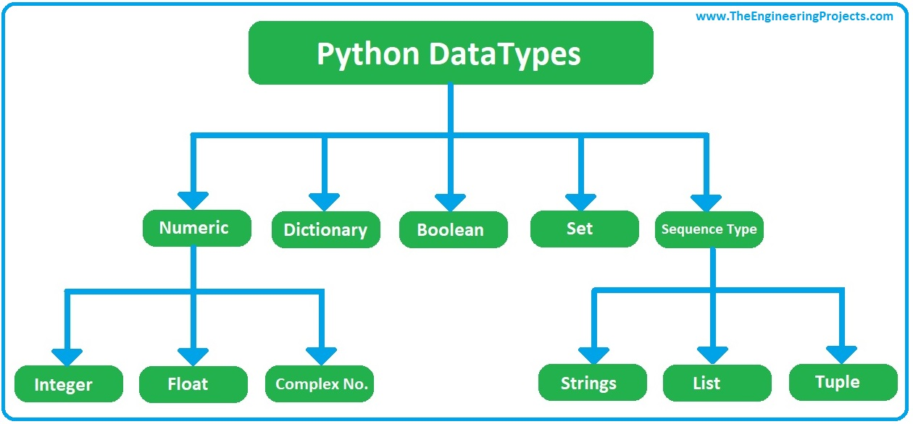

# VARIABLES


---


## DATA TYPES: CATEGORIES

Variables can store data of different types, and different types can do different things.
Python has the following data types built-in by default, in these categories:


Categories      |  data types
----------------|-------------------------------
Text Type:      | str
Numeric Types:  | int, float, complex
Sequence Types: | list, tuple, range
Mapping Type: 	| dict
Set Types: 	    | set, frozenset
Boolean Type: 	| bool
Binary Types: 	| bytes, bytearray, memoryview


**Example**: Find variable data type:
```python
x = 5
print(type(x)) # Get data type
```





---


## LEGAL VARIABLE NAMES

- A variable name must start with a letter or the underscore character
- A variable name cannot start with a number
- A variable name can only contain alpha-numeric characters and underscores (A-z, 0-9, and _ )
- Variable names are case-sensitive (age, Age and AGE are three different variables)

```python
myvar = "John"
my_var = "John"
_my_var = "John"
myVar = "John"
MYVAR = "John"
myvar2 = "John"
myVariableName = "John"     # Camel case - each word, except first, starts with capital letter
MyVariableName = "John"     # Pascal case - each word starts with capital letter
my_variable_name = "John"   # Each word is separated by an underscore character:
```


---


## ASSIGNMENT STATEMENT

In Python, the data type is set when you assign a value to a variable:

Assignment                                   | Data type
---------------------------------------------|------------
x = "Hello World" 	                         | str
x = 20 	                                     | int
x = 20.5 	                                   | float
x = ["apple", "banana", "cherry"]            | list
x = range(6) 	                               | range
x = ("apple", "banana", "cherry")            | tuple
x = True 	                                   | bool
x = 1j 	                                     | complex
x = {"name" : "John", "age" : 36} 	         | dict
x = {"apple", "banana", "cherry"} 	         | set
x = frozenset({"apple", "banana", "cherry"}) | frozenset
x = b"Hello" 	                               | bytes
x = bytearray(5) 	                           | bytearray
x = memoryview(bytes(5)) 	                   | memoryview


---


## SPECIFICATION / CASTING

Specify the data type:

Specification                                | Data type
---------------------------------------------|-------------
x = str("Hello World") 	                     | str
x = int(20) 	                               | int
x = float(20.5) 	                           | float
x = list(("apple", "banana", "cherry")) 	   | list
x = range(6) 	                               | range
x = tuple(("apple", "banana", "cherry")) 	   | tuple
x = bool(5) 	                               | bool
x = complex(1j) 	                           | complex
x = dict(name="John", age=36) 	             | dict
x = set(("apple", "banana", "cherry")) 	     | set
x = frozenset(("apple", "banana", "cherry")) | frozenset
x = bytes(5) 	                               | bytes
x = bytearray(5) 	                           | bytearray
x = memoryview(bytes(5)) 	                   | memoryview


**Specify a type on to a variable**:

```python
x = int(1)   # x will be 1
```


---


## ASSIGN MULTIPLE VARIABLES

```python
x, y, z = "Orange", "Banana", "Cherry"  # multiple variables in one line
x = y = z = "Orange"                    # same value to multiple variables
```


---


## UNPACK VARIABLES

```python
fruits = ["apple", "banana", "cherry"]
x, y, z = fruits
```


---


## DELETE VARIABLES

```python
x = 5
my_list = ["a", "b", "c"]
del x               # deletes the variable
del my_list         # deletes the list
del my_list[3:5]    # deletes items in the list
```


---


## GLOBAL VARIABLES

- Variables that are created outside of a function (as in all of the examples above) are known as global variables.
- Global variables can be used by everyone, both inside of functions and outside.

```python
x = "awesome"
def myfunc():
    x = "fantastic"     # Create a variable inside a function, with the same name as the global variable
    # use the global keyword if you want to change a global variable inside a function.
    y = global("cool")  # use the global keyword, the variable belongs to the global scope
  print("Python is " + x)

myfunc()
print(x)
```

If you create a variable with the same name inside a function, this variable will be local, and can only be used inside the function.


```python
c = 0 # global variable

def add():
    global c
    c = c + 2 # increment by 2
    print("Inside add():", c)

add()
print("In main:", c)
```


---


## MUTABLE vs IMMUTABLE objects

 - Immutable objects can not be  modified
 - This is helpful, because you know the value
 - Make objects immutable if you need to seal it
 - Make mutable objects if you need to constantly modify it


**Example**: mutable object
```python
mutable_obj = ['a', 'b', 'c']
mutable_obj[1] = 'x'
print(mutable_obj)
```
```
>> `['a', 'x', 'c']`
```


**Example**: immutable object
```python
mutable_obj = ('a', 'b', 'c')
mutable_obj[1] = 'x'
```
```
>> TypeError: 'tuple' object does not support  item assignment
```

Class     | Description                          | Immutable? | Example
----------|--------------------------------------|------------|-----------------
bool      | Boolean value                        | yes        |  
int       | integer (arbitrary magnitude)        | yes        |
float     | floating-point number                | yes        |
list      | mutable sequence of objects          |            | x = (1, 2, 3)
tuple     | immutable sequence of objects        | yes        |
str       | charachter string                    | yes        | x = '12B'
set       | unordered set of distinct objects    |            |
frozenset | immutable form of set class          | yes        | x = ([1, 2, 3])
dict      | associative mapping (aka dictionary) |            |


---