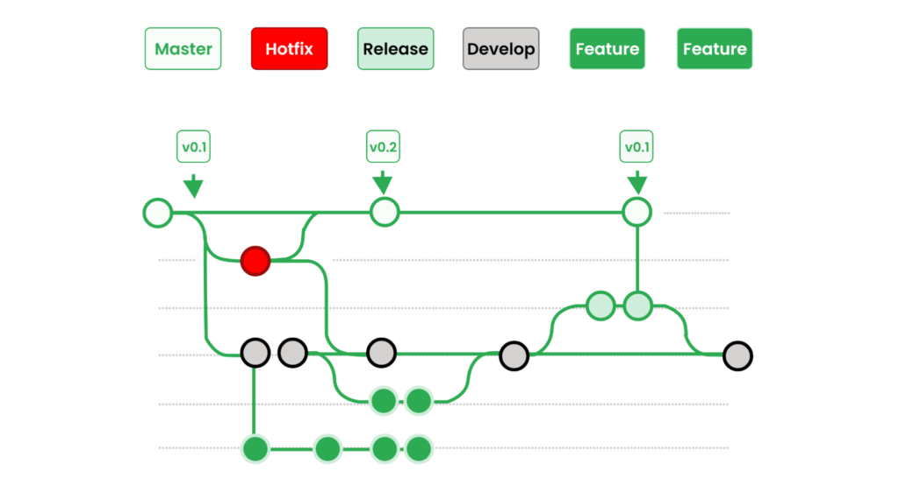

# VERSION CONTROL

---

## VERSION CONTROL SYSTEM (VCS)

"Git" is a Version Control System (VCS).
You commit your changes to your repository.

---

## REPOSITORIES

Your project folder contains a repository.
You commit your changes to your repository.
Host repositories online at:
  1. GitHub.com
  2. BitBucket

---

## GRAPHICAL USER INTERFACES (GUI)

  1. "Atlassian SourceTree" (for BitBucket)
  2. "GitHub Desktop" for GitHub
  3. Gitkraken.com

---

## SHARE CODE SNIPPETS

1. Gist.github.com
Instantly share code, notes, and snippets.
  - Create private Gist
  - Create public Gist

[https://gist.github.com/](https://gist.github.com/)
