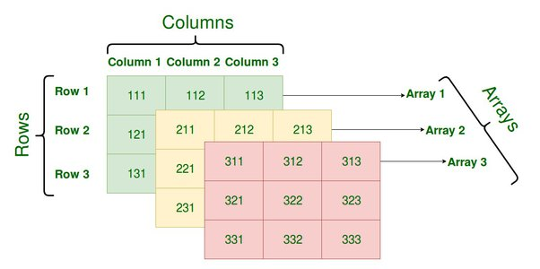
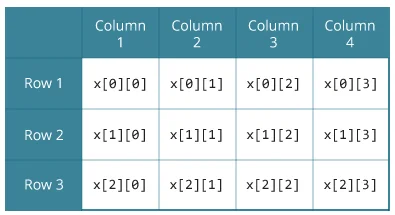

# C#: MULTIDIMENSIONAL ARRAYS


--- 


## LINKS

[C# - Multidimensional Arrays](https://www.tutorialsteacher.com/csharp/csharp-multi-dimensional-array)

[Multidimensional Arrays (C# Programming Guide)](https://learn.microsoft.com/en-us/dotnet/csharp/programming-guide/arrays/multidimensional-arrays)

[C# Multidimensional Array](https://www.programiz.com/csharp-programming/multidimensional-arrays)


---


## SYNTAX

<type>[number of dimensions/commas]<variable/array name> = <keyword new><type>[rows, columns, arrays]




---


## DESCRIPTION

Arrays can have more than one dimension. Also knows as a rectangular array.

In a multidimensional array, each element of the array is also an array. For example,


Example: **An array of arrays**
```cs
// Array has two elements: {1, 2, 3} and {3, 4, 5}
// Each element of the array is also an array with 3 elements.
int[ , ] x = { { 1, 2 ,3}, { 3, 4, 5 } };
```


Example: **Two-dimensional array of three rows and four columns**

```cs
int[,] array = new int[3, 4];   // [ rows, columns]
```




Example: **an array of three dimensions, 4, 4, and 3**

```cs
int[,,] array1 = new int[4, 2, 3];  // [rows, colums, arrays]
```


