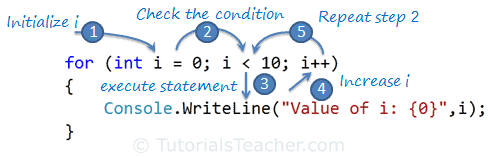

## C# FOR LOOP


---


## LINKS

[]()


---


## DESCRIPTION

Here, you will learn how to execute a statement or code block multiple times using the for loop, structure of the for loop, nested for loops, and how to exit from the for loop.

The `for` keyword indicates a loop in C#. The `for` loop executes a block of statements repeatedly until the specified condition returns false.

The `for` loop contains the following three optional sections, separated by a semicolon:

**Initializer**:
- The initializer section is used to initialize a variable that will be local to a for loop and cannot be accessed outside loop. It can also be zero or more assignment statements, method call, increment, or decrement expression e.g., ++i or i++, and await expression.

**Condition**:
- The condition is a boolean expression that will return either true or false. If an expression evaluates to true, then it will execute the loop again; otherwise, the loop is exited.

**Iterator**:
- The iterator defines the incremental or decremental of the loop variable.


---


## SYNTAX

```cs
for (initializer; condition; iterator)
{
    //code block 
}
```


---


## EXAMPLES

```cs
for(int i = 0; i < 10; i++)
{
    Console.WriteLine("Value of i: {0}", i);
}
```

**CODE BLOCK WITH SINGLE STATEMENT**:
```cs
// If a code block only contains a single statement, then you don't need to wrap it inside curly brackets { }, as shown below.
for(int i = 0; i < 10; i++)
    Console.WriteLine("Value of i: {0}", i);
```

```cs
// An Initializer, condition, and iterator sections are optional.
// You can initialize a variable before for loop, and condition and iterator can be defined inside a code block. 
int i = 0;

for(;;)
{
    if (i < 10)
    {
        Console.WriteLine("Value of i: {0}", i);
        i++;
    }
    else
        break;
}
```

All 3 variants give the same outcome/output:
```
> Value of i: 0
> Value of i: 1
> Value of i: 2
> Value of i: 3
> Value of i: 4
> Value of i: 5
> Value of i: 6
> Value of i: 7
> Value of i: 8
> Value of i: 9
```

1. `int i = 0` is an initializer where we define an int variable `i` and initialize it with 0.
2. If condition expression `i < 10` returns `true` then it will execute a code block.
3. After executing the code block, it will go to the third section, iterator. The `i++` is an incremental statement that increases the value of a loop variable `i` by 1.
4. Now, it will check the conditional expression again and repeat the same thing until conditional expression returns `false`.

The below figure illustrates the execution steps of the `for` loop.




---


## INFINITE `FOR LOOP`

Since all three sections are optional in the for loop, be careful in defining a condition and iterator. Otherwise, it will be an infinite loop that will never end the loop.

```cs
// Stop using Ctrl+C in the integrated terminal window
for ( ; ; )
{
    Console.Write(1);
}
```
```
> 1 1 1 1 1 1 1 1 1 1 1 1 1 1 1 1 1 1 1.....
```


---


## CONTROL VARIABLE

The control variable for the for loop can be of any numeric data type, such as double, decimal, etc. 

```cs
for (double d = 1.01D; d < 1.10; d+= 0.01D)
{
    Console.WriteLine("Value of i: {0}", d);
}
```
```
> Value of i: 1.01
> Value of i: 1.02
> Value of i: 1.03
> Value of i: 1.04
> Value of i: 1.05
> Value of i: 1.06
> Value of i: 1.07
> Value of i: 1.08
> Value of i: 1.09
```


---


## REVERSE `FOR LOOP`

```cs
for(int i = 10; i > 0; i--)
{
    Console.WriteLine("Value of i: {0}", i);
}
```
```
> Value of i: 10
> Value of i: 9
> Value of i: 8
> Value of i: 7
> Value of i: 6
> Value of i: 5
> Value of i: 4
> Value of i: 3
> Value of i: 2
> Value of i: 1 
```


---


## EXIT THE `FOR LOOP`

You can also exit from a for loop by using the `break` keyword.

```cs
for (int i = 0; i < 10; i++)
{
    if( i == 5 )
        break;

    Console.WriteLine("Value of i: {0}", i);
}
```
```
> Value of i: 0
> Value of i: 1
> Value of i: 2
> Value of i: 3
> Value of i: 4 
```


---


## SKIP THE REMAINDER OF THE OPERATION

You can also skip the remainder of the operation by using the `continue` keyword.

```cs


```cs
for (int i = 0; i < 5; i++)
{
    if( i == 3 )    // will skip i = 3
        continue;

    Console.WriteLine("Value of i: {0}", i);
}
```
```
Value of i: 0
Value of i: 1
Value of i: 2
Value of i: 4
```


---


## MULTIPLE EXPRESSIONS

A `for` loop can also include multiple initializer and iterator statements separated by comma, as shown below.

```cs
for (int i = 0, j = 0; i+j < 5; i++, j++)
{
    Console.WriteLine("Value of i: {0}, J: {1} ", i,j);
}
```
```
> Value of i: 0, J: 0
> Value of i: 1, J: 1
> Value of i: 2, J: 2 
```


A `for` loop can also contain statements as an initializer and iterator.


---


## INITIALIZER & ITERATOR STATEMENTS

| Sections:   | Statements                                      |
|-------------|-------------------------------------------------|
| Initializer | Console.WriteLine($"Initializer: i={i}, j={j}") |
| Condition   | i++ < j--                                       |
| Iterator    | Console.WriteLine($"Iterator: i={i}, j={j}")    |

```cs
int i = 0, j = 5;
for (Console.WriteLine($"Initializer: i={i}, j={j}");
    i++ < j--;
    Console.WriteLine($"Iterator: i={i}, j={j}")
    )
    {
    }
```
```
> Initializer: i=0, j=5
> Iterator: i=1, j=4
> Iterator: i=2, j=3
> Iterator: i=3, j=2
```


---


## NESTER `FOR LOOP`

C# allows a for loop inside another for loop.

```cs
for (int i = 0; i < 2; i++)
{
    for(int j =i; j < 4; j++)
        Console.WriteLine("Value of i: {0}, J: {1} ", i,j);
}
```
```
> Value of i: 0, J: 0
> Value of i: 0, J: 1
> Value of i: 0, J: 2
> Value of i: 0, J: 3
> Value of i: 1, J: 1
> Value of i: 1, J: 2
> Value of i: 1, J: 3 
```


