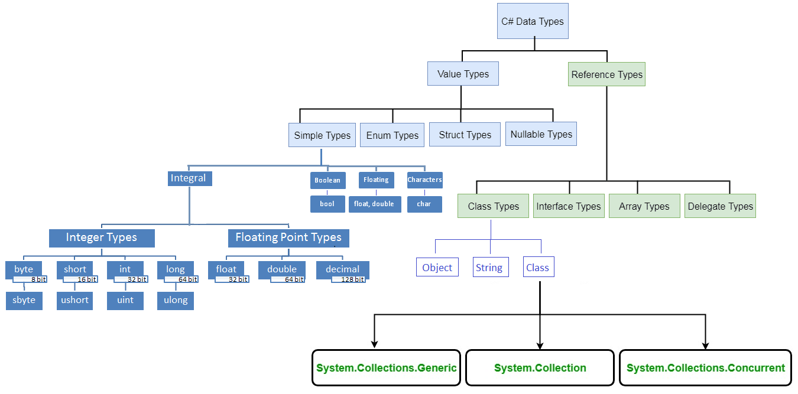
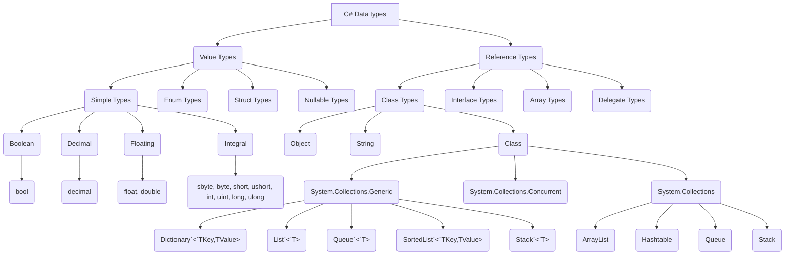

# C# DATA TYPES / VARIABLES


---


## LINKS

[C# Variables](https://www.w3schools.com/cs/cs_variables.php)
[C# - Data Types](https://www.tutorialsteacher.com/csharp/csharp-data-types)
[Value Type and Reference Type](https://www.tutorialsteacher.com/csharp/csharp-value-type-and-reference-type)
[default literal](https://learn.microsoft.com/en-us/dotnet/csharp/language-reference/operators/default#default-literal)


---


## ABOUT COMMENTS

C# is a strongly-typed language. It means we must declare the type of a variable that indicates the kind of values it is going to store, such as integer, float, decimal, text, etc. 

Variables are containers for storing data values.

In C#, there are different types of variables (defined with different keywords), for example:

    int - stores integers (whole numbers), without decimals, such as 123 or -123
    double - stores floating point numbers, with decimals, such as 19.99 or -19.99
    char - stores single characters, such as 'a' or 'B'. Char values are surrounded by single quotes
    string - stores text, such as "Hello World". String values are surrounded by double quotes
    bool - stores values with two states: true or false


---


## TYPE CATEGORIES

C# mainly categorized data types in two types: Value types and Reference types. Value types include simple types (such as int, float, bool, and char), enum types, struct types, and Nullable value types. Reference types include class types, interface types, delegate types, and array types. Learn about value types and reference types in detail in the next chapter. 





Mermaid Graph: **C# Data Types**



---


## PREDEFINES DATA TYPES IN C#

C# includes some predefined value types and reference types. The following table lists predefined data types: 

Table: **Value Types**
|# | Type     | Description                                                  | Range                                                           | Suffix |
|--|:--------:|:------------------------------------------------------------:|:---------------------------------------------------------------:|:------:|
|1 | byte     | 8-bit unsigned integer                                       | 0 to 255                                                        |        |
|2 | sbyte    | 8-bit signed integer                                         | -128 to 127                                                     |        |
|3 | short    | 16-bit signed integer                                        | -32,768 to 32,767                                               |        |
|4 | ushort   | 16-bit unsigned integer                                      | 0 to 65,535                                                     |        |
|5 | int      | 32-bit signed integer                                        | -2,147,483,648  to  2,147,483,647                               |        |
|6 | uint     | 32-bit unsigned integer                                      | 0 to 4,294,967,295                                              | u      |
|7 | long     | 64-bit signed integer                                        | -9,223,372,036,854,775,808  to  9,223,372,036,854,775,807       | l      |
|8 | ulong    | 64-bit unsigned integer                                      | 0 to 18,446,744,073,709,551,615                                 | ul     |
|9 | float    | 32-bit Single-precision floating point type                  | -3.402823e38 to 3.402823e38                                     | f      |
|10| double   | 64-bit double-precision floating point type                  | -1.79769313486232e308 to 1.79769313486232e308                   | d      |
|10| decimal  | 128-bit decimal type for financial and monetary calculations | (+ or -)1.0 x 10e-28  to  7.9 x 10e28                           | m      |
|12| char     | 16-bit single Unicode character                              | Any valid character, e.g. a,*, \x0058 (hex), or\u0058 (Unicode) |        |
|13| bool     | 8-bit logical true/false value                               | True or False                                                   |        |
|14| object   | Base type of all other types.                                |                                                                 |        |
|15| string   | A sequence of Unicode characters                             |                                                                 |        |
|16| DateTime | Represents date and time                                     | 0:00:00am 1/1/01  to  11:59:59pm 12/31/9999                     |        |


Table: **Reference types**
| C# type keyword |   .NET type   |
|:---------------:|:-------------:|
| object          | System.Object |
| string          | System.String |
| dynamic         | System.Object |


Each data type (except string and object) includes value range. The compiler will give an error if the value goes out of datatype's permitted range. For example, int data type's range is -2,147,483,648 to 2,147,483,647. So if you assign a value which is not in this range, then the compiler would give an error.


---


## SUFFIX THE VALUE OF UNASSIGNED

The value of unsigned integers, long, float, double, and decimal type must be suffix by u,l,f,d, and m, respectively.

```cs
uint ui = 100u;
float fl = 10.2f;
long l = 45755452222222l;
ulong ul = 45755452222222ul;
double d = 11452222.555d;
decimal mon = 1000.15m;
```


---


## ALIAS vs .NET TYPE

The predefined data types are alias to their `.NET type` (CLR class) name. The following table lists alias for predefined data types and related `.NET class` name. 

|   Alias  |    .NET Type    | Type   |
|:--------:|:---------------:|:------:|
| byte     | System.Byte     | struct |
| sbyte    | System.SByte    | struct |
| int      | System.Int32    | struct |
| uint     | System.UInt32   | struct |
| short    | System.Int16    | struct |
| ushort   | System.UInt16   | struct |
| long     | System.Int64    | struct |
| ulong    | System.UInt64   | struct |
| float    | System.Single   | struct |
| double   | System.Double   | struct |
| char     | System.Char     | struct |
| bool     | System.Boolean  | struct |
| object   | System.Object   | struct |
| string   | System.String   | struct |
| decimal  | System.Decimal  | struct |
| DateTime | System.DateTime | struct |

It means that whether you define a variable of int or Int32, both are the same.

```cs
int i = 345;
Int32 i = 345;// same as above 
```


---


## DEFAULT VALUES

Every data type has a default value. Numeric type is 0, boolean has false, and char has '\0' as default value. Use the default(typename) to assign a default value of the data type or C# 7.1 onward, use `default literal`.

```cs
int i = default(int); // 0
float f = default(float);// 0
decimal d = default(decimal);// 0
bool b = default(bool);// false
char c = default(char);// '\0'

// C# 7.1 onwards
int i = default; // 0
float f = default;// 0
decimal d = default;// 0
bool b = default;// false
char c = default;// '\0'
```


---


## CONVERSION

The values of certain data types are automatically converted to different data types in C#. This is called an implicit conversion.

```cs
// the value of an integer variable i is assigned to the variable of float type f because this conversion operation is predefined in C#.
int i = 345;
float f = i;

Console.WriteLine(f);
```
```
> 345
```

| #  | Implicit Conversion From |                               To                              |
|----|--------------------------|---------------------------------------------------------------|
| 1  | sbyte                    | short, int, long, float, double, decimal                      |
| 2  | byte                     | short, ushort, int, uint, long, ulong, float, double, decimal |
| 3  | short                    | int, long, float, double, or decimal                          |
| 4  | ushort                   | int, uint, long, ulong, float, double, or decimal             |
| 5  | int                      | long, float, double, or decimal.                              |
| 6  | uint                     | long, ulong, float, double, or decimal                        |
| 7  | long                     | float, double, or decimal                                     |
| 8  | ulong                    | float, double, or decimal                                     |
| 9  | char                     | ushort, int, uint, long, ulong, float, double, or decimal     |
| 10 | float                    | Double                                                        |

Conversions from int, uint, long, or ulong to float and from long or ulong to double may cause a loss of precision. No data type implicitly converted to the char type.

However, not all data types are implicitly converted to other data types. For example, int type cannot be converted to uint implicitly. It must be specified explicitly, as shown below.

**Explicit/specified conversion**:
```cs
// integer i is converted to uint explicitly by specifying uint in the brackets (uint). This will convert an integer to uint. 
public static void Main()
{
    int i = 100;
    uint u = (uint) i;
    Console.Write(i);
}
```
```
> 100
```