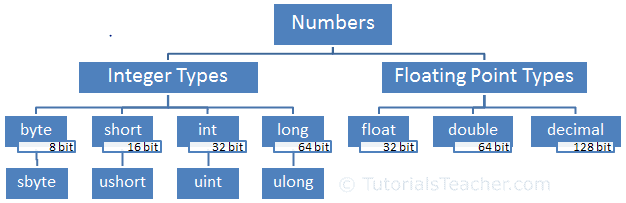

# C# NUMBERS

---

## LINKS

[Numbers in C#](https://www.tutorialsteacher.com/csharp/numbers)

---

## NUMBERS IN C#

---

## NUMBERS IN C#

Numbers, in general, can be divided into two types: `Integer type` and `floating-point types`.

 - `Integer type` numbers are whole numbers without decimal points. It can be negative or positive numbers.
 - `Floating-point type` is numbers with one or more decimal points. It can be negative or positive numbers.

C# includes different data types for integer types and floating-point types based on their size in the memory and capacity to store numbers.

The following figure illustrates numeric types in C#. 

---

## INTERGER TYPES

`Integer type` numbers are whole numbers without decimal points. It can be negative or positive numbers.
`Integer type` numbers are positive or negative whole numbers without decimal points.
C# includes four data types for integer numbers: byte, short, int, and long. 

| #  | type/keyword |                          Range                          |                Size               |    .NET type   |
|----|:------------:|:-------------------------------------------------------:|:---------------------------------:|:--------------:|
| 1  | sbyte        | -128 to 127                                             | Signed 8-bit integer              | System.SByte   |
| 2  | byte         | 0 to 255                                                | Unsigned 8-bit integer            | System.Byte    |
| 3  | short        | -32,768 to 32,767                                       | Signed 16-bit integer             | System.Int16   |
| 4  | ushort       | 0 to 65,535                                             | Unsigned 16-bit integer           | System.UInt16  |
| 5  | int          | -2,147,483,648 to 2,147,483,647                         | Signed 32-bit integer             | System.Int32   |
| 6  | uint         | 0 to 4,294,967,295                                      | Unsigned 32-bit integer           | System.UInt32  |
| 7  | long         | -9,223,372,036,854,775,808 to 9,223,372,036,854,775,807 | Signed 64-bit integer             | System.Int64   |
| 8  | ulong        | 0 to 18,446,744,073,709,551,615                         | Unsigned 64-bit integer           | System.UInt64  |
| 9  | nint         | Depends on platform (computed at runtime)               | Signed 32-bit or 64-bit integer   | System.IntPtr  |
| 10 | nuint        | Depends on platform (computed at runtime)               | Unsigned 32-bit or 64-bit integer | System.UIntPtr |

---

## FLOATING-POINT TYPES

`Floating-point type` is numbers with one or more decimal points. It can be negative or positive numbers.

| #  | type/keyword |        Approximate range       |   Precision   |   Size   |    .NET type   |
|----|:------------:|:------------------------------:|:-------------:|:--------:|:--------------:|
| 9  | float        | ±1.5 x 10−45 to ±3.4 x 1038    | ~6-9 digits   | 4 bytes  | System.Single  |
| 10 | double       | ±5.0 × 10−324 to ±1.7 × 10308  | ~15-17 digits | 8 bytes  | System.Double  |
| 11 | decimal      | ±1.0 x 10-28 to ±7.9228 x 1028 | 28-29 digits  | 16 bytes | System.Decimal |

---