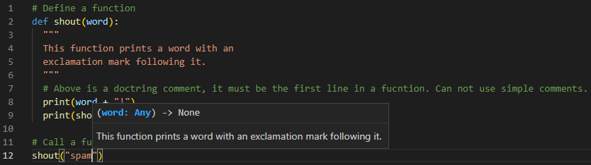
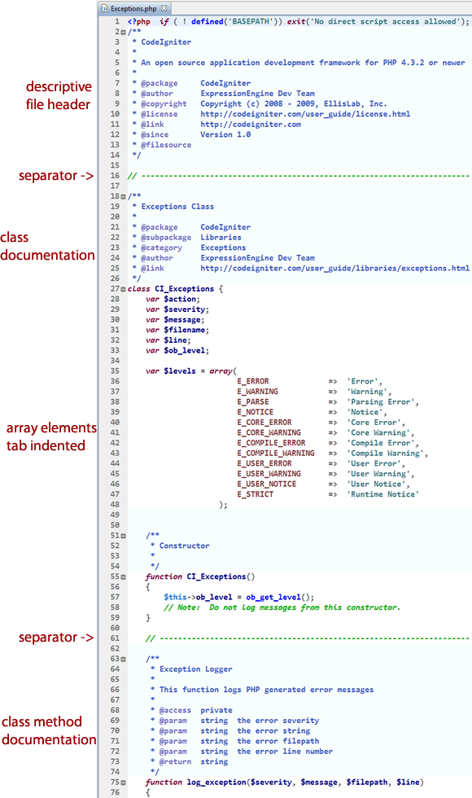

# CODE QUALITY


---


## LINKS

[Best Practices for Writing Super Readable Code](https://code.tutsplus.com/tutorials/top-15-best-practices-for-writing-super-readable-code--net-8118)

[setting-code-success-write-secure-reliable-maintainable-code](https://walkingtree.tech/setting-code-success-write-secure-reliable-maintainable-code/)


---


## DESCRIPTION

Code quality is a set of attributes and standards that the organization has defined and prioritized. The following are the primary characteristics that can help improve code quality:

1. Clarity:
   
   The code is simple to read and maintain for anyone who isn’t the writer. It is much easier to maintain and extend code that is simple to understand. Not only computers but also humans must comprehend it.

2. Maintainable:
   
   Good code isn’t overly complicated. Anyone dealing with the code must grasp the entire context of the code to make modifications.

3. Well Documented:
   
   It’s ideal if the code is self-explanatory, but it’s always a good idea to add comments to the code to describe its purpose and functions. It makes it considerably easier for anyone who did not contribute to the code’s creation to comprehend and maintain it.

4. Well-tested:
   
   The lower the number of flaws in the code, the greater its quality. Thorough testing eliminates important flaws, ensuring that the software functions as intended.

5. Refactored:
   
   Code formatting must be consistent and adhere to the coding rules of the language.

6. Extendable:
   
   The code you get must be able to be extended. It’s not ideal when you have to discard it after a few weeks.

7. Efficiency:
   
   High-quality code does not waste resources to achieve the desired activity.

A good piece of code does not have to match all of the criteria listed above, but the more it does, the better the outcome of the software would be. These specifications are more akin to a priority list based on the specifics of your project.


---


## CODE PRACTICES:


---


## COMMENTING & DOCUMENTATION

1. Use dostrings for commenting complex functions

   Comment out functions with sophisticated logic, such as those with 100 lines of code. These comments are essentially shortcuts that explain what your function is supposed to perform, saving other programmers time from figuring it out.

   


2. AvoidObvious comments


3. Leave helpful comments


5. Leave a quick note at the beginning of each file

   This type of comment should be no more than three lines long and should provide a concise picture of the objective and scope of your code. If your coworker looks at your file, they should be able to figure out what it’s about in less than 30 seconds.


6. Fill in the blanks at the start of each class with remarks

   his comment clarifies the purpose and scope of a class within a file. You can add a comment like this:

   ```python
   # The class below will help to find the item record with a unique identifier. It returns an item */ public class ItemCategory { rest of the code goes here }
   ```


---


## INDENTATION STYLE

Keep consistent indentation. There are different coding styles. You may use any. But best to stick to one.

See a subtopic `indentation_style.md` file for more info.


---


## CONSISTENT NAMING SCHEME

1. Use Meaningful Names for Variables and Functions
   
   E.g. `$is_vaccine_available` vs `$iva`


2. Consistent Temporary Names
   
   Normally, the variables should be descriptive and contain one or more words. But this doesn't necessarily apply to temporary variables. They can be as short as a single character.


---


## DRY PRINCIPLE

DRY stands for Don't Repeat Yourself. Also known as DIE: Duplication is Evil.

Every piece of knowledge must have a single, unambiguous, authoritative representation within a system.


---


## NESTING - DENESTING

Too many levels of nesting can make code harder to read and lead to `increased complexity` and `decreased readability`.

Do not make more than 3 levels of nesting. `3 levels max`.

See a subtopic in `denesting.md` file.


---


## LINE LENGTH

Our eyes are more comfortable when reading tall and narrow columns of text.

It is a good practice to avoid writing horizontally long lines of code.


---


## FILE & FOLDER ORGANIZATION

Technically, you could write an entire application's code within a single file. But that would be a nightmare to read and maintain.


---


## CAPITALIZE SQL SPECIAL WORDS

Database interaction is a big part of most web applications. If you are writing raw SQL queries, it is a good idea to keep them readable as well.

Even though SQL special words and function names are case insensitive, it is common practice to capitalize them to distinguish them from your table and column names.


---


## SEPARATE CODE FROM DATA

1. Separate HTML & PHP
   
   In the case of web development, the "data" usually implies HTML output.


---


## Object-Oriented vs. Procedural

Object-oriented programming can help you create well-structured code. But that does not mean you need to abandon procedural programming completely. Actually, creating a mix of both styles can be good.


---


## Read Open-Source Code

Open-source projects are built with the input of many developers. These projects need to maintain a high level of code readability so that the team can work together as efficiently as possible. Therefore, it is a good idea to browse through the source code of these projects to observe what these developers are doing.




---


## AVOID HARDCODING / MAGIC NUMBERS

The concept of magic numbers in programming refers to the use of hard-coded numerical values in your code. Using such numbers might make sense to you while you are writing the code. However, you or someone else will most probably have a hard time figuring out what that number was supposed to do when they look at the same piece of code in future.


---


## CODE REFACTORING

When you "refactor," you make changes to the code without changing any of its functionality. You can think of it like a "cleanup," for the sake of improving readability and quality.

See a subtopic `codeRefactoring_about.md` file in `code_quality` folder.


---


## USE CODE LINTER

A code linter is a program that automatically evaluates your code to verify if it follows the coding conventions of your project or organization. If it does not conform to the convention, linters will display warnings.

A `Python` developer, for example, could use `Pylint` to analyze code and maintain code quality.


---


## 


