## CODE REFACTORING TECHNIQUE: ORGANIZING DATA


---


## LINKS

[Refactoring Techniques](https://refactoring.guru/refactoring/techniques)


---


## 3. ORGANIZING DATA

These refactoring techniques help with data handling, replacing primitives with rich class functionality. Another important result is untangling of class associations, which makes classes more portable and reusable.

- 3.1  Change Value to Reference
- 3.2  Change Reference to Value
- 3.3  Duplicate Observed Data
- 3.4  Self Encapsulate Field
- 3.5  Replace Data Value with Object
- 3.6  Replace Array with Object
- 3.7  Change Unidirectional Association to Bidirectional
- 3.8  Change Bidirectional Association to Unidirectional
- 3.9  Encapsulate Field
- 3.10 Encapsulate Collection
- 3.11 Replace Magic Number with Symbolic Constant
- 3.12 Replace Type Code with Class
- 3.13 Replace Type Code with Subclasses
- 3.14 Replace Type Code with State/Strategy
- 3.15 Replace Subclass with Fields


---


## 3.1 Self Encapsulate Field

Self-encapsulation is distinct from ordinary Encapsulate Field: the refactoring technique given here is performed on a private field.

**Problem**

You use direct access to private fields inside a class.

```cs
class Range 
{
  private int low, high;
  
  bool Includes(int arg) 
  {
    return arg >= low && arg <= high;
  }
}
```


**Solution**

Create a getter and setter for the field, and use only them for accessing the field.

```cs
class Range 
{
  private int low, high;
  
  int Low {
    get { return low; }
  }
  int High {
    get { return high; }
  }
  
  bool Includes(int arg) 
  {
    return arg >= Low && arg <= High;
  }
}
```


---


## 3.2 Replace Data Value with Object

**Problem**

A class (or group of classes) contains a data field. The field has its own behavior and associated data.

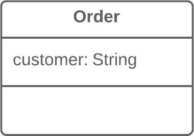


**Solution**

Create a new class, place the old field and its behavior in the class, and store the object of the class in the original class.


---


## 3.3 Change Value to Reference

**Problem**

So you have many identical instances of a single class that you need to replace with a single object.


**Solution**

Convert the identical objects to a single reference object.


---


## 3.4 Change Reference to Value

**Problem**

You have a reference object that’s too small and infrequently changed to justify managing its life cycle.


**Solution**

Turn it into a value object.


---


## 3.5 Replace Array with Object

This refactoring technique is a special case of Replace Data Value with Object.

**Problem**

You have an array that contains various types of data.

```cs
string[] row = new string[2];
row[0] = "Liverpool";
row[1] = "15";
```


**Solution**

Replace the array with an object that will have separate fields for each element.

```cs
Performance row = new Performance();
row.SetName("Liverpool");
row.SetWins("15");
```


---


## 3.6 Duplicate Observed Data

**Problem**

Is domain data stored in classes responsible for the GUI?

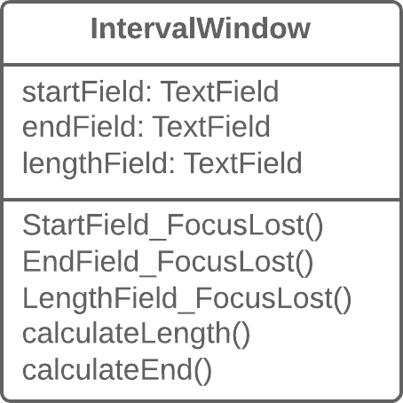


**Solution**

Then it’s a good idea to separate the data into separate classes, ensuring connection and synchronization between the domain class and the GUI.


---


## 3.7 Change Unidirectional Association to Bidirectional

**Problem**

You have two classes that each need to use the features of the other, but the association between them is only unidirectional.


**Solution**

Add the missing association to the class that needs it.


---


## 3.8 Change Bidirectional Association to Unidirectional

**Problem**

You have a bidirectional association between classes, but one of the classes doesn’t use the other’s features.


**Solution**

Remove the unused association.


---


## 3.9 Replace Magic Number with Symbolic Constant

**Problem**

Your code uses a number that has a certain meaning to it.

```cs
double PotentialEnergy(double mass, double height) 
{
  return mass * height * 9.81;
}
```


**Solution**

Replace this number with a constant that has a human-readable name explaining the meaning of the number.

```cs
const double GRAVITATIONAL_CONSTANT = 9.81;

double PotentialEnergy(double mass, double height) 
{
  return mass * height * GRAVITATIONAL_CONSTANT;
}
```


---


## 3.10 Encapsulate Field

**Problem**

You have a public field.

```cs
class Person 
{
  public string name;
}
```


**Solution**

Make the field private and create access methods for it.

```cs
class Person 
{
  private string name;

  public string Name
  {
    get { return name; }
    set { name = value; }
  }
}
```


---


## 3.11 Encapsulate Collection

**Problem**

A class contains a collection field and a simple getter and setter for working with the collection.

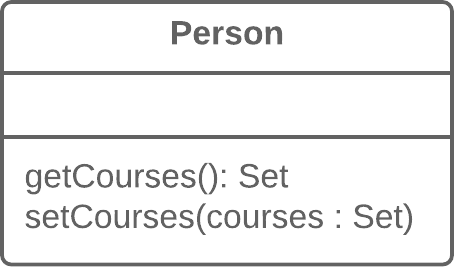

**Solution**

Make the getter-returned value read-only and create methods for adding/deleting elements of the collection.

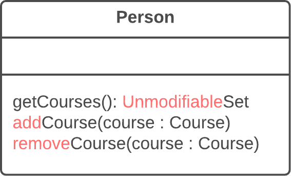


---


## 3.12 Replace Type Code with Class

    What’s type code? Type code occurs when, instead of a separate data type, you have a set of numbers or strings that form a list of allowable values for some entity. Often these specific numbers and strings are given understandable names via constants, which is the reason for why such type code is encountered so much.

**Problem**

A class has a field that contains type code. The values of this type aren’t used in operator conditions and don’t affect the behavior of the program.

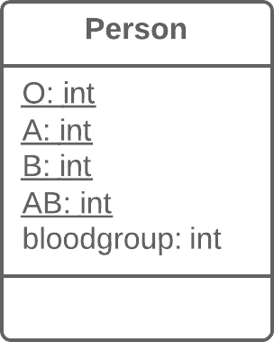


**Solution**

Create a new class and use its objects instead of the type code values.

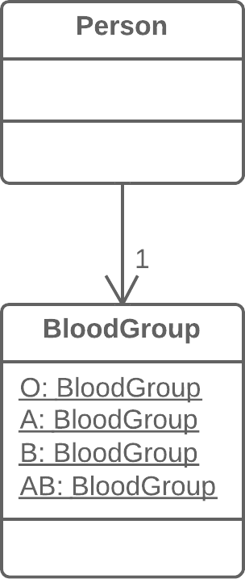


---


## 3.13 Replace Type Code with Subclasses

    What’s type code? Type code occurs when, instead of a separate data type, you have a set of numbers or strings that form a list of allowable values for some entity. Often these specific numbers and strings are given understandable names via constants, which is the reason for why such type code is encountered so much.

**Problem**

You have a coded type that directly affects program behavior (values of this field trigger various code in conditionals).


**Solution**

Create subclasses for each value of the coded type. Then extract the relevant behaviors from the original class to these subclasses. Replace the control flow code with polymorphism.

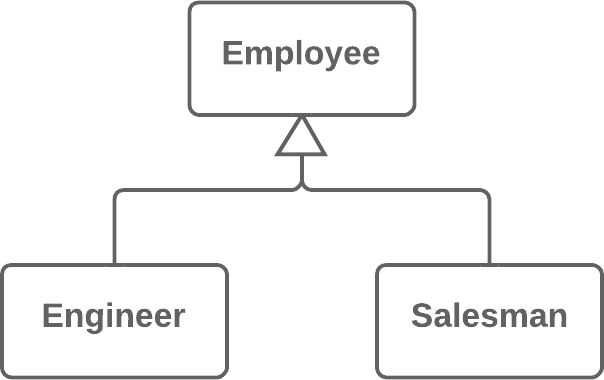


---


## 3.14 Replace Type Code with State/Strategy

    What’s type code? Type code occurs when, instead of a separate data type, you have a set of numbers or strings that form a list of allowable values for some entity. Often these specific numbers and strings are given understandable names via constants, which is the reason for why such type code is encountered so much.

**Problem**

You have a coded type that affects behavior but you can’t use subclasses to get rid of it.

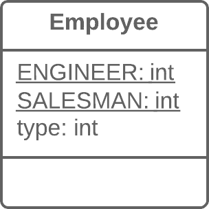


**Solution**

Replace type code with a state object. If it’s necessary to replace a field value with type code, another state object is “plugged in”.

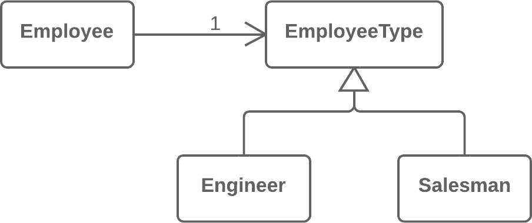


---


## 3.15 Replace Subclass with Fields

**Problem**

You have subclasses differing only in their (constant-returning) methods.

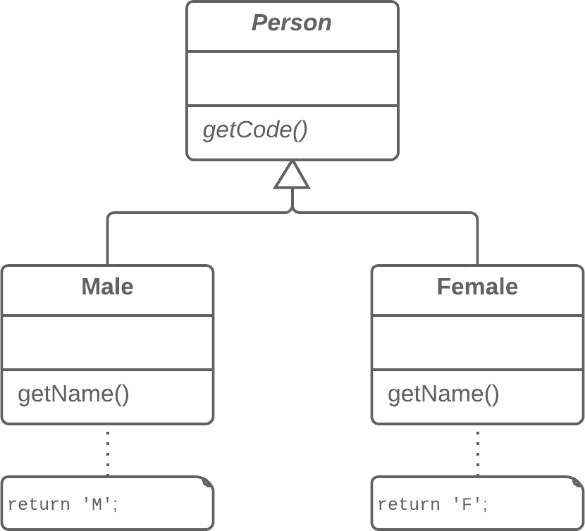


**Solution**

Replace the methods with fields in the parent class and delete the subclasses.

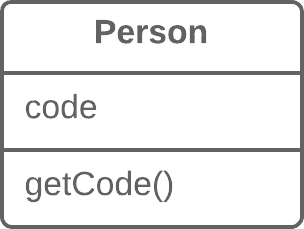


