## CODE REFACTORING TECHNIQUES


---


## LINKS

[Refactoring Techniques](https://refactoring.guru/refactoring/techniques)


---


## Dealing with Generalization

Abstraction has its own group of refactoring techniques, primarily associated with moving functionality along the class inheritance hierarchy, creating new classes and interfaces, and replacing inheritance with delegation and vice versa.

- 6.1  Pull Up Field
- 6.2  Pull Up Method
- 6.3  Pull Up Constructor Body
- 6.4  Push Down Field
- 6.5  Push Down Method
- 6.6  Extract Subclass
- 6.7  Extract Superclass
- 6.8  Extract Interface
- 6.9  Collapse Hierarchy
- 6.10 Form Template Method
- 6.11 Replace Inheritance with Delegation
- 6.12 Replace Delegation with Inheritance


---


## 6.1 Pull Up Field

**Problem**

Two classes have the same field.

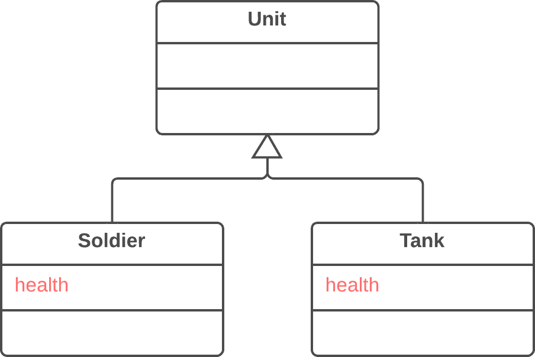


**Solution**

Remove the field from subclasses and move it to the superclass.

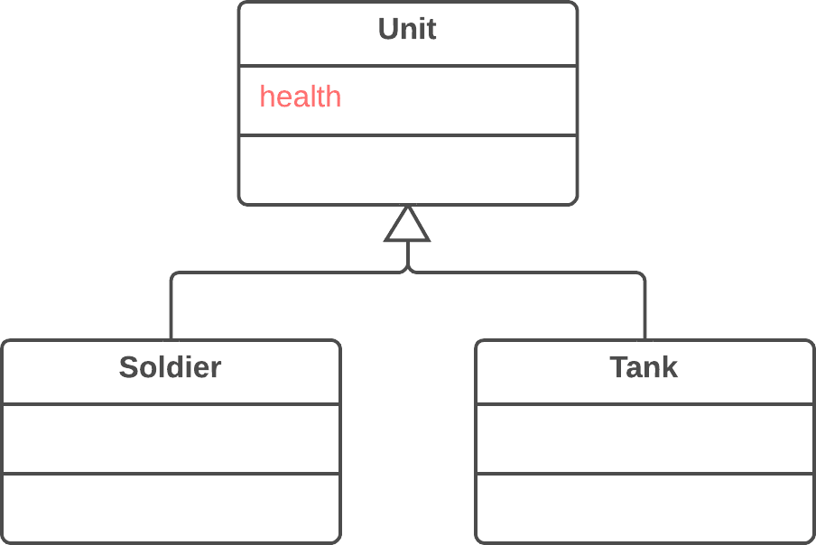


---


## 6.2 Pull Up Method

**Problem**

Your subclasses have methods that perform similar work.

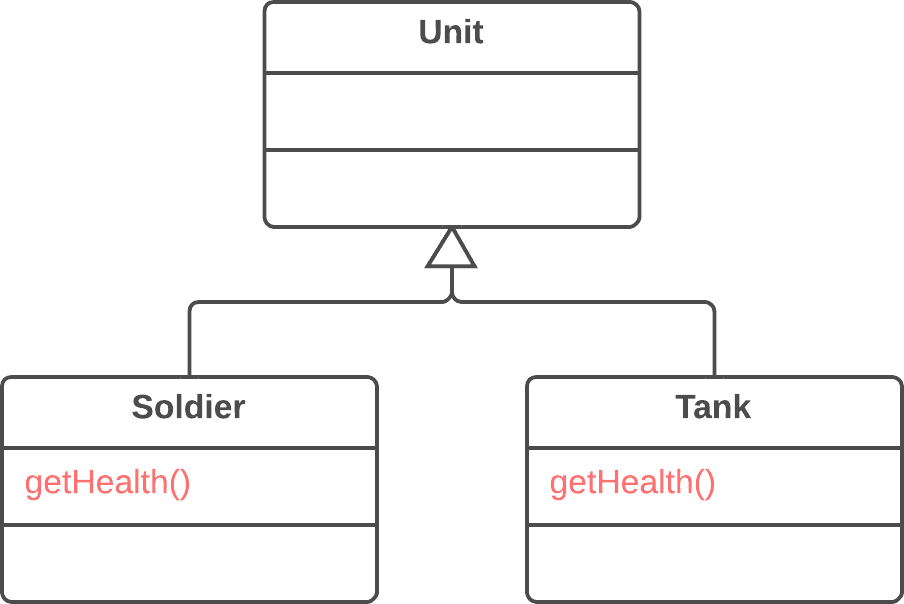


**Solution**

Make the methods identical and then move them to the relevant superclass.


---


## 6.3 Pull Up Constructor Body

**Problem**

Your subclasses have constructors with code that’s mostly identical.

```cs
public class Manager: Employee 
{
  public Manager(string name, string id, int grade) 
  {
    this.name = name;
    this.id = id;
    this.grade = grade;
  }
  // ...
}
```


**Solution**

Create a superclass constructor and move the code that’s the same in the subclasses to it. Call the superclass constructor in the subclass constructors.

```cs
public class Manager: Employee 
{
  public Manager(string name, string id, int grade): base(name, id)
  {
    this.grade = grade;
  }
  // ...
}
```


---


## 6.4 Push Down Field

**Problem**

Is a field used only in a few subclasses?

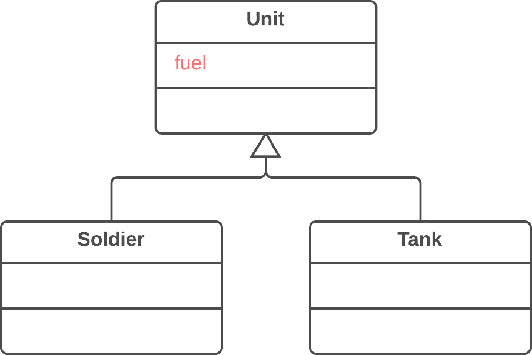


**Solution**

Move the field to these subclasses.

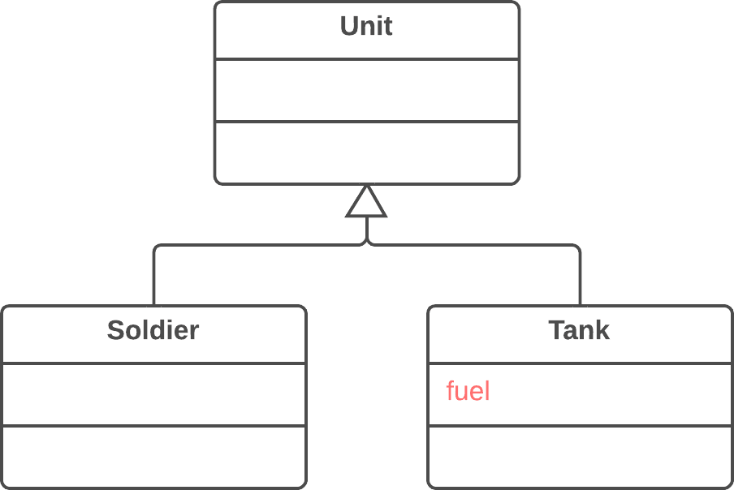


---


## 6.5 Push Down Method

**Problem**

Is behavior implemented in a superclass used by only one (or a few) subclasses?

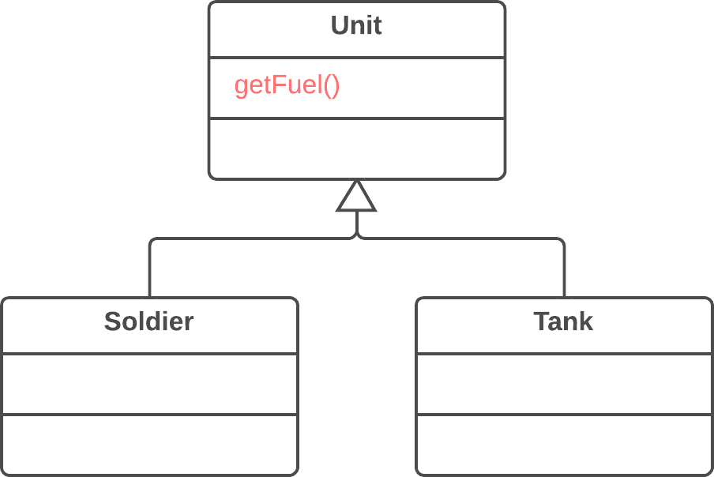


**Solution**

Move this behavior to the subclasses.

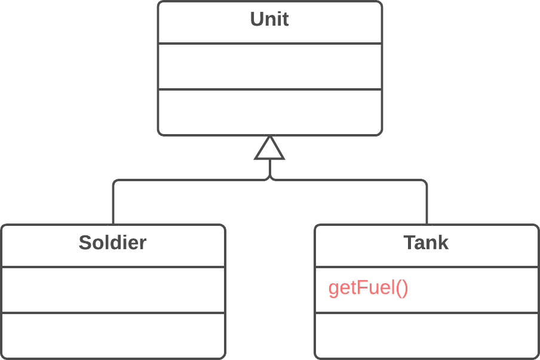


---


## 6.6 Extract Subclass

**Problem**

A class has features that are used only in certain cases.

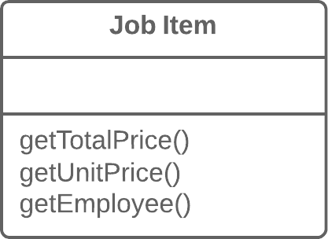


**Solution**

Create a subclass and use it in these cases.

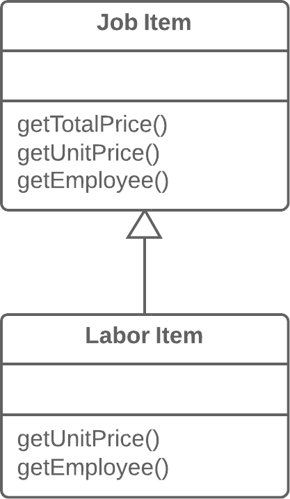


---


## 6.7 Extract Superclass

**Problem**

You have two classes with common fields and methods.

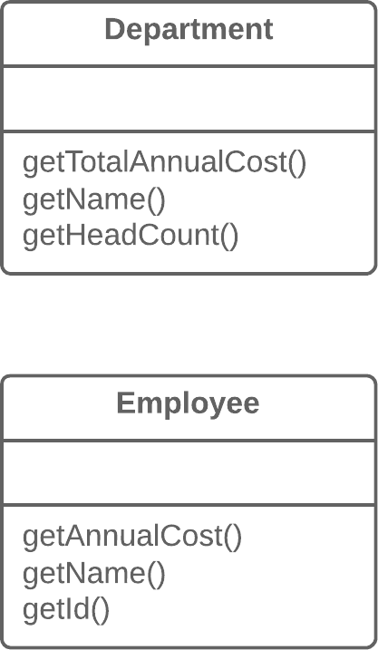


**Solution**

Create a shared superclass for them and move all the identical fields and methods to it.

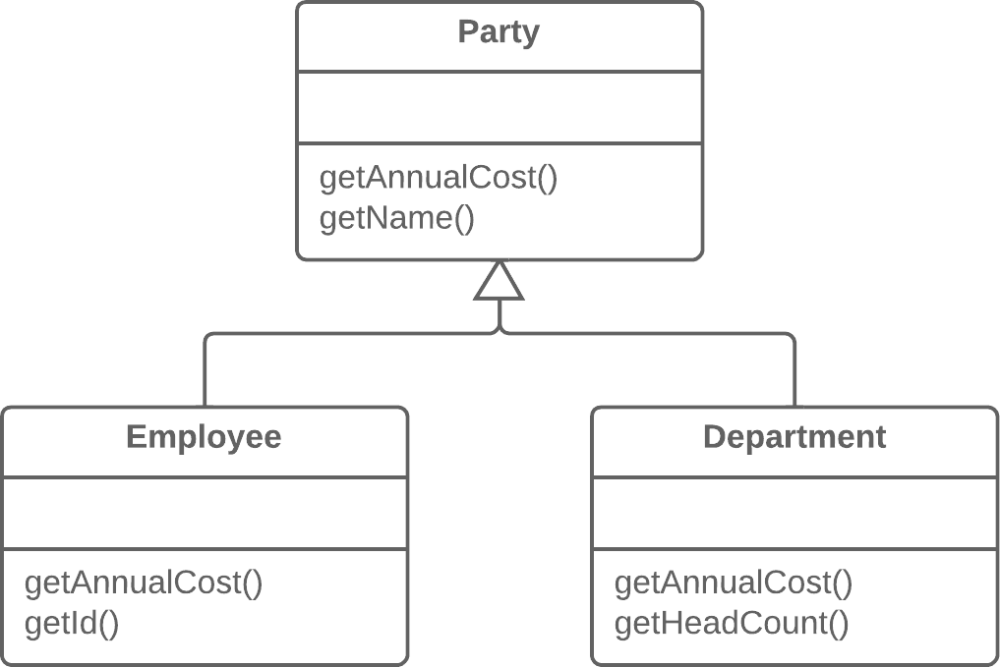


---


## 6.8 Extract Interface

**Problem**

Multiple clients are using the same part of a class interface. Another case: part of the interface in two classes is the same.

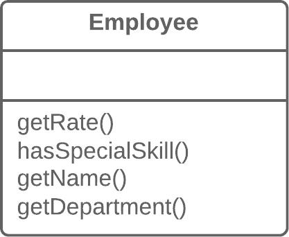


**Solution**

Move this identical portion to its own interface.

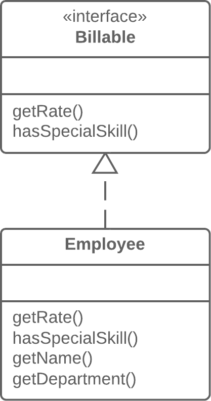


---


## 6.9 Collapse Hierarchy

**Problem**

You have a class hierarchy in which a subclass is practically the same as its superclass.

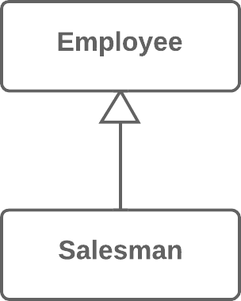


**Solution**

Merge the subclass and superclass.


---


## 6.10 Form Template Method

**Problem**

Your subclasses implement algorithms that contain similar steps in the same order.

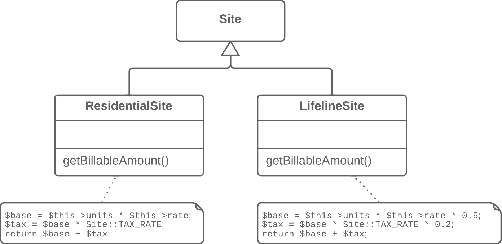


**Solution**

Move the algorithm structure and identical steps to a superclass, and leave implementation of the different steps in the subclasses.


---


## 6.11 Replace Inheritance with Delegation

**Problem**

You have a subclass that uses only a portion of the methods of its superclass (or it’s not possible to inherit superclass data).

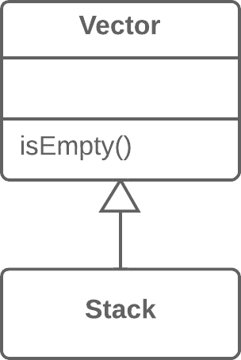


**Solution**

Create a field and put a superclass object in it, delegate methods to the superclass object, and get rid of inheritance.

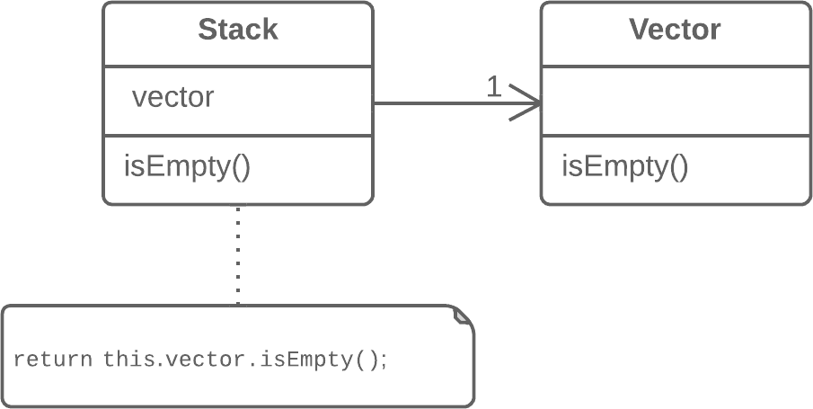


---


## 6.12 Replace Delegation with Inheritance

**Problem**

A class contains many simple methods that delegate to all methods of another class.

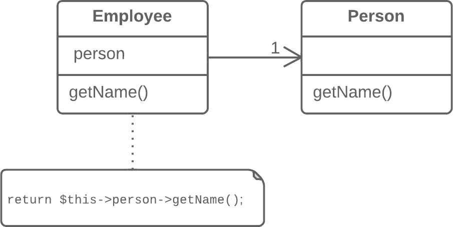


**Solution**

Make the class a delegate inheritor, which makes the delegating methods unnecessary.

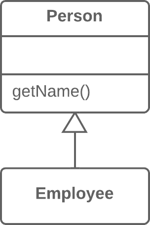


