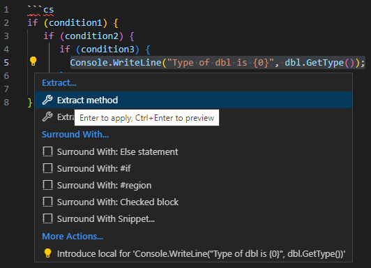
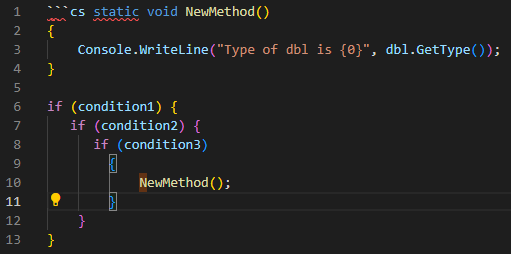

# NESTING - DENESTING


---


## LINKS

[Why You Shouldn't Nest Your Code](https://www.youtube.com/watch?v=CFRhGnuXG-4)


---


## DESCRIPTION

Too many levels of nesting can make code harder to read and lead to `increased complexity` and `decreased readability`.

Do not make more than 3 levels of nesting. `3 levels max`.


---


## 1. EXTRACTION METHOD

Use functions and subroutines to break up your code into smaller, modular chunks. This allows you to separate different logic and functionality, making it easier to understand and maintain.

Take a nested code block and extract it into its own function or subroutine.

In this example, the nested code block is extracted into a function called `doSomething`. This allows us to quickly reference the code block from multiple places in our program `without duplicating the nested code` structure.

The extraction method is a simple and effective way to denest your code and can be applied to any nested code block.

**Original nested code**:
```cs
if (condition1) {
   if (condition2) {
      if (condition3) {
         // Do something
      }
   }
}
```

**Extracted code**:
```cs
function doSomething() {
  // Do something
}

if (condition1) {
  if (condition2) {
    if (condition3) {
      doSomething();
    }
  }
}
```


---


## EXTRACTION METHOD IN VISUAL STUDIO CODE

1. Select the text (expression/code block) to be extracted into a method
   
2. Launch the Command Palette via the shortcut (`Ctrl+Shift+P` or `cmd+.`) or press the `Yellow bulb` to the left
   
3. Select the `Extract Method` command
   
4. The selected expression(s) or block(s) of code will be extracted into a method with a random 5. name prefixed `newmethod`
   
5. Next provide a new name for this method


**Before**:




**After**:




---


## 2. INVERSION METHOD

Flip conditions! Use conditional statements (like if/else or switch/case) to handle different scenarios without nesting code blocks. This allows you to easily control the flow of your program without adding unnecessary complexity. Creates `create a more streamlined and efficient structure`.

In this example, the nested code block is inverted by using the logical `OR` operator `||` to combine the three conditional statements. This allows us to avoid nesting code blocks and create a more concise and efficient structure.

Example1: **Original code**:
```cs
if (condition1) {
  if (condition2) {
    if (condition3) {
      // Do something
    }
  }
}
```
**Inverted code**:
```cs
if (!condition1 || !condition2 || !condition3) {
  return;
}

// Do something
```


Example2: **Oroginal code**
```cs
if (grid[x,y].isAlive)
{
  // Cell is alive
  if (grid[x,y].numNeighbours == 2 || grid[x,y].numNeighbours == 3)
  {
    grid[x,y].SetAlive(true);
  }
  else
  {
    grid[x,y].SetAlive(false);
  }
}
```
// We shortened our code by 3 lines
**New code: reverse logic**
```cs
if (grid[x,y].isAlive)
{
  // Cell is alive
  if (grid[x,y].numNeighbours != 2 && grid[x,y].numNeighbours != 3)
  {
      grid[x,y].SetAlive(false);
  }
}
```


---