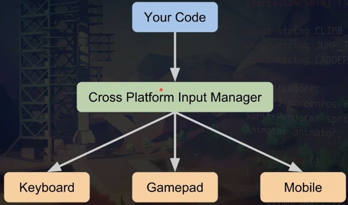

# CROSS PLATFORM INPUT


---


## DESCRIPTION

Unity Game Engine uses `Cross Platform Input Manager`. It is a middle layer for talking between unity and different platforms.




---


## KEYBOARD COMMANDS

```cs
if (Input.GetKey(KeyCode.A))
{
    RotateManually(rotationThisFrame);
}
else if (Input.GetKeyDown(KeyCode.L))
{
    LoadNextLevel();
}
```


---


## GAMEPAD


---


## MOBILE


---