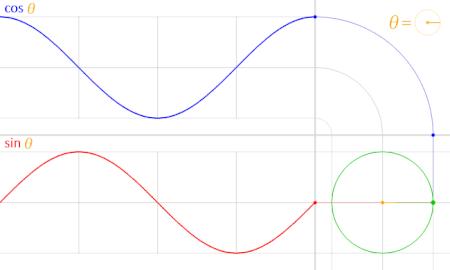
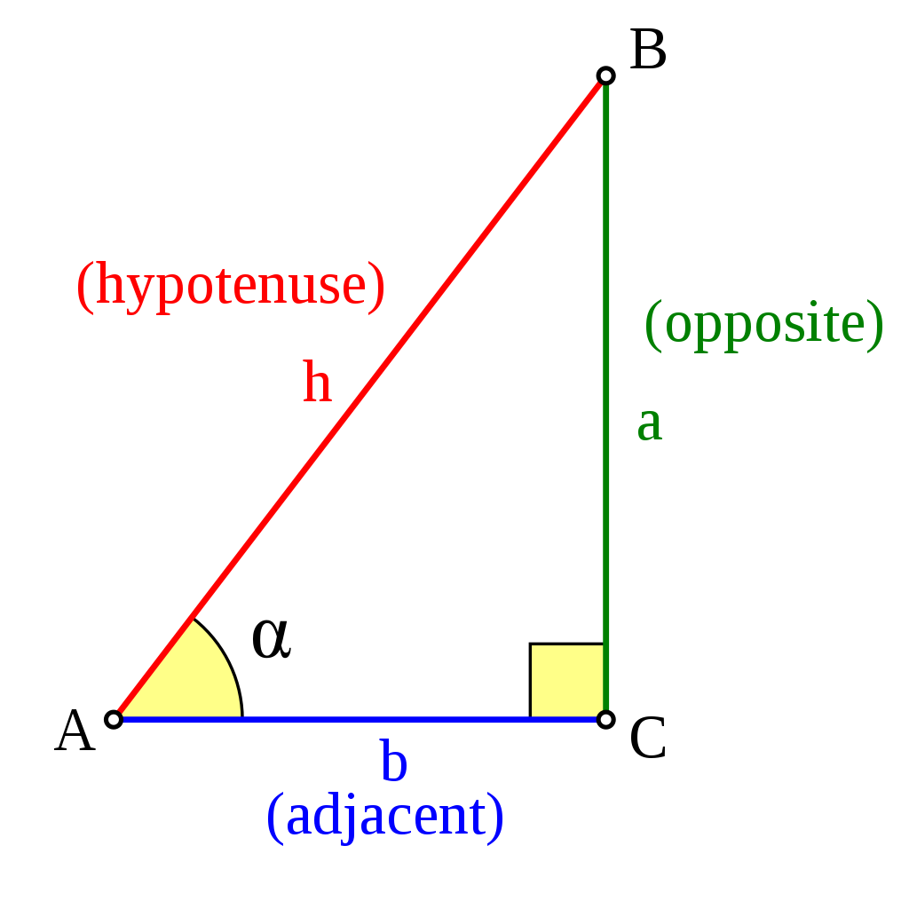
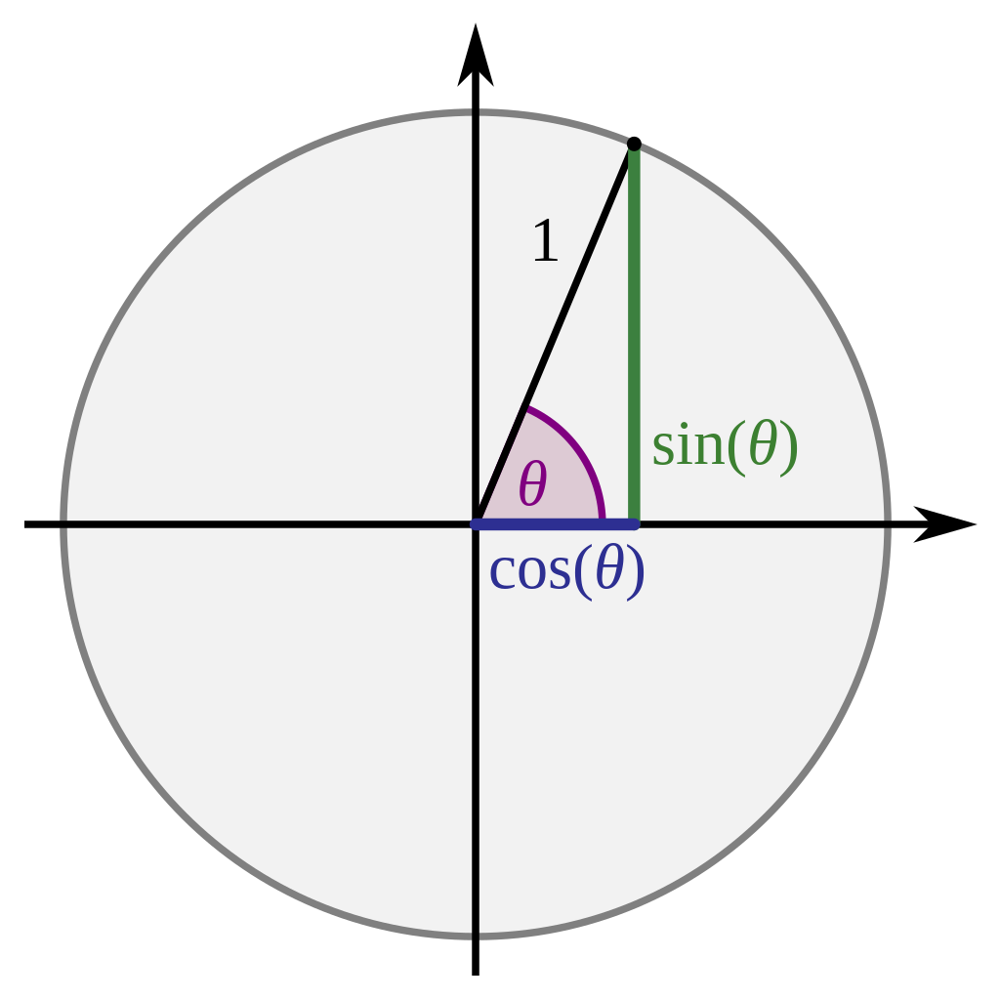
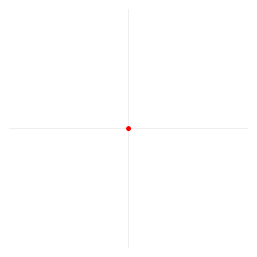
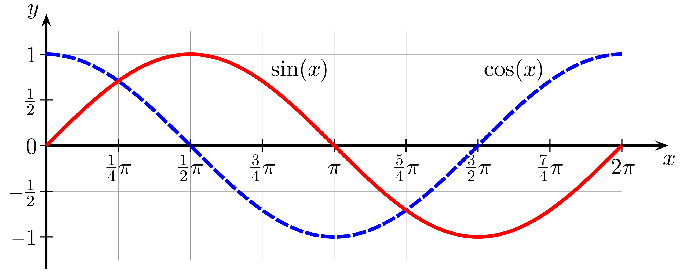

# SINE & COSINE

---

## LINKS

[Sine and cosine: Wikipedia](https://en.wikipedia.org/wiki/Sine_and_cosine)
[Turn (angle): Radians: Wikipedia](https://en.wikipedia.org/wiki/Turn_(angle))

---

## DESCRIPTION

In mathematics, sine and cosine are trigonometric functions of an angle. The sine and cosine of an acute angle are defined in the context of a right triangle: for the specified angle, its sine is the ratio of the length of the side that is opposite that angle to the length of the longest side of the triangle (the hypotenuse), and the cosine is the ratio of the length of the adjacent leg to that of the hypotenuse. For an angle θ \theta , the sine and cosine functions are denoted simply as sinA and cosA.

---

## USED FOR

1. A movement of an object, e.g. a lift platform: The platform moves up and down. The platform slows down on each end.

---

## PICTURES

