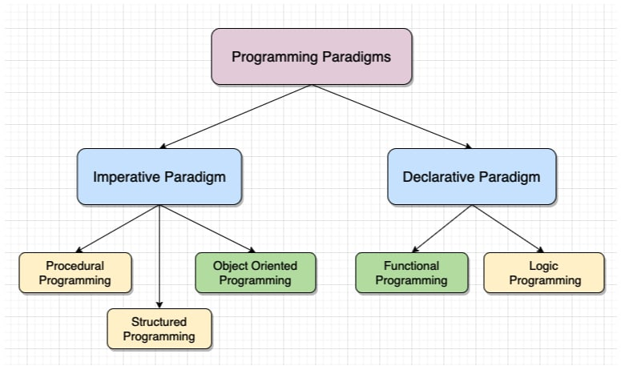

# Programming paradigms

---

## CHAPTER ORDER

- Object-oriented programming (oop_class.md)
- Functional programming (functional_programming.md)

---

## PARADIGMS

`Imperative` in which the programmer instructs the machine how to change its state (using statements, loops, and functions as subroutines)
  - `procedural` which groups instructions into procedures,
  - `object-oriented` (OOP) which groups instructions with the part of the state they operate on,

`Declarative` in which the programmer merely declares properties of the desired result, but not how to compute it
  - `functional` in which the desired result is declared as the value of a series of function applications (using pure functions, higher-order functions, and recursion),
  - `logic` in which the desired result is declared as the answer to a question about a system of facts and rules,
  - `mathematical` in which the desired result is declared as the solution of an optimization problem
  - `reactive` in which the desired result is declared with data streams and the propagation of change
